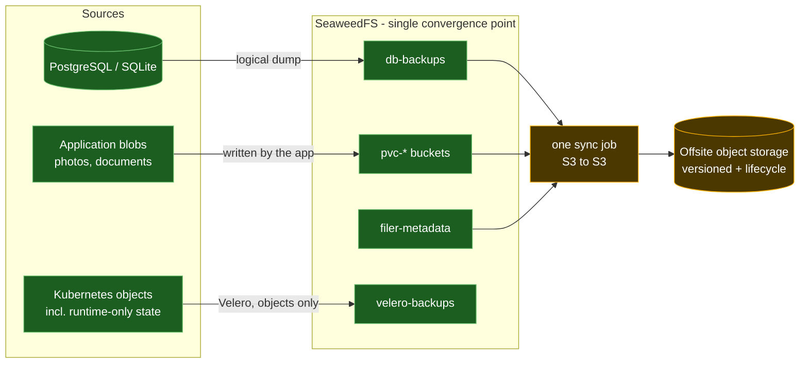

# Backup Architecture

**Status:** problem statement and target design. Partially implemented.
**Related:** [ADR-003](adr/0003-backup-immutability-versioning-only.md), `docs/backlog.md`

## Problem statement

**This cluster had no working backup of any persistent data for 37 days, and reported success
the entire time.**

Velero ran on schedule, produced backup objects, and shipped them to two storage locations.
Inspecting every `PodVolumeBackup` ever recorded showed the only volumes it had captured were
`dshm`, `tmp` and `empty-dir` — ephemeral scratch. Not one PersistentVolumeClaim. The cause
was two independent silent failures:

- Velero's file-system backup **skips hostPath volumes by design**. Every `local-path` PVC in
  this cluster is hostPath-backed, so no `PodVolumeBackup` was created at all. No error, no
  warning — the volume simply was not in the backup.
- On SeaweedFS CSI volumes a `PodVolumeBackup` *was* created and then **failed with an empty
  error message**, leaving a `PartiallyFailed` backup that looked like a transient glitch.

Two further faults compounded it, both self-inflicted and both invisible until looked for:

- A metadata backup job wrote into Velero's own S3 bucket. Velero rejects unknown top-level
  prefixes in its bucket and marked the `BackupStorageLocation` **Unavailable**, which fails
  every backup at validation. Sharing a bucket looked harmless and silently disabled the
  entire local backup target.
- The storage layer's FUSE mount daemon had no memory limit, inherited a 256Mi namespace
  default, and was OOM-killed under load. Every SeaweedFS volume on the node returned EIO at
  once. The symptom surfaced as application errors — an app returning 500s with database I/O
  errors — which points investigation away from storage.

The through-line is not that backups were misconfigured. It is that **every failure mode was
silent**, and several presented as something other than a backup problem. A backup system that
reports success while storing nothing is worse than none: it converts a known gap into a false
assurance, and it trains everyone to ignore the one alarm that should never be ignored.

### Secondary problem: no single component can cover this cluster

| Layer | Velero | SeaweedFS native | Logical dumps |
|---|---|---|---|
| Kubernetes objects | yes | no concept of them | no |
| Databases | hostPath skipped when on local-path | cannot see them | yes |
| Application blobs (SeaweedFS) | FUSE path fails | yes | no |

The recommended Kubernetes approach — CSI volume snapshots — is unavailable here: the
`snapshot.storage.k8s.io` CRDs are not installed, and the SeaweedFS CSI driver implements no
`CreateSnapshot` (the chart ships no `external-snapshotter` sidecar). That is why file-system
backup was in use at all, and it is the fallback that failed.

## Constraints

- **Homelab, not production.** Proportionality governs. Immutability was evaluated and
  declined in [ADR-003](adr/0003-backup-immutability-versioning-only.md); versioning plus
  lifecycle retention is the accepted offsite protection level.
- **Databases stay off FUSE.** PostgreSQL depends on POSIX `fsync` durability, which is not a
  safe assumption on a network FUSE filesystem, and the CSI mount service is documented
  upstream as not resilient to its own restarts. Keeping databases off SeaweedFS also means a
  total storage failure does not take out the identity provider needed to log in and repair it.

  This originally meant `local-path`, the only alternative at the time. Since
  [ADR-004](adr/0004-longhorn-v1-storage-engine.md) it means Longhorn, which presents an
  ordinary ext4 block device and so satisfies the same requirement without pinning a pod to
  one node or hiding the volume from every backup mechanism. The one deliberate exception is
  the SeaweedFS filer's own metadata database, which stays on `local-path` so that restoring
  SeaweedFS never depends on SeaweedFS.
- **Prefer few moving parts.** Every component is one more thing to maintain, and one more
  thing that can fail quietly.

## Target design

Everything that must survive converges into SeaweedFS through normal operation, and a single
job copies SeaweedFS offsite. Nothing traverses FUSE on the backup path.

**Why this shape**

- **Databases are dumped logically, never snapshotted.** A byte-level copy of a live database
  is crash-consistent, not a consistent backup. Dumps are also indifferent to the volume type
  underneath, which makes the hostPath problem irrelevant rather than worked around.
- **Blobs are already in SeaweedFS**, and — critically — **readable over the S3 API**. The CSI
  volumes are ordinary buckets, so the backup path uses a stable HTTP API instead of the FUSE
  mount that failed. The fragile component is removed from the backup path entirely.
- **Velero is reduced to what it alone can do**: the Kubernetes object graph, including the
  runtime-generated state Git does not hold — issued TLS secrets, PV binding identity,
  operator-created resources. With file-system backup off, its node-agent DaemonSet is removed;
  that pod ran as root with a hostPath mount of every pod's volumes on the node.
- **One job leaves the cluster.** Retention and point-in-time recovery come from the
  destination bucket's versioning and lifecycle rules, because SeaweedFS's own replication is a
  mirror and would faithfully propagate a deletion.

### What "all green" looks like

Health is defined by observable signals, not by the absence of complaints:

| Signal | Green |
|---|---|
| Velero backup phase | `Completed`, zero errors, zero warnings — never `PartiallyFailed` |
| `BackupStorageLocation` | both `Available` |
| Database dump jobs | complete daily; each artifact above its minimum-size guard |
| Artifact validity | dumps carry a valid header; SQLite passes `integrity_check` |
| Offsite sync | last run recent; object count and bytes non-decreasing |
| Mount daemon | zero restarts; memory well under limit |
| Restore drill | performed and passing, on a schedule |

The last row matters most and is the only one that proves the rest. Everything above it shows
that data was *written*; only a restore shows it can be *read back*.

## Current state

**Done**

- Logical dumps for Keycloak and Paperless into `db-backups`, each refusing to upload an
  implausibly small artifact. That guard immediately caught a real fault — a `pg_dump` major
  version mismatch producing a 20-byte file — which would otherwise have been stored as a
  successful backup containing nothing.
- Immich's database is dumped by Immich itself, daily and version-matched, into its own library
  volume. No second job is needed.
- Filer metadata dumped to its own bucket. Without it the blobs are anonymous and
  unrecoverable, which makes it the highest-value, smallest-volume target in the cluster.
- Velero reduced to objects only; node-agent DaemonSet removed.
- Application blobs on SeaweedFS and confirmed readable over S3.
- Alerting on mount-daemon restarts and memory, on filesystem capacity, and on OOM kills with
  the affected workload actually named.

**Outstanding**

- The offsite sync job. Everything converges into SeaweedFS today, but nothing yet copies
  SeaweedFS out of the cluster on a schedule.
- A restore drill. Artifacts are verified to decode; nothing has been restored.

## Upstream assessment

Checked whether the two structural limitations are likely to be fixed for us.

**Mount service restart resilience — acknowledged, not scheduled.** The limitation is stated by
the project itself, and the documented answer is the `OnDelete` update strategy: manual,
controlled recycles to avoid disrupting active mounts. That is a workaround, not a fix. Related
open issues describe adjacent failure modes, including a pod starting *without* its mount after
an initial mount error — the same silent-failure character seen here. Treat a mount-daemon
restart as an outage requiring manual recovery; that is the supported model, not a temporary
state.

**CSI snapshots — no evidence of planned support.** Nothing found in the driver's repository
indicates `CreateSnapshot` is coming. The recommended Velero path should be assumed unavailable
indefinitely, which is why this design routes around it via the S3 API rather than waiting.

**The operator is worth watching.** SeaweedFS ships a Kubernetes operator advertising scheduled
backup and restore with filer metadata snapshots plus continuous data mirroring to S3, GCS,
Azure, B2 or a PVC — close to the design above, packaged. Two cautions before counting on it:
some of that material appears on the commercial site, so the split between open-source and
Enterprise capability was not established here; and adopting it would replace the existing
Helm-based deployment, a larger change than the sync job it would displace. Worth re-checking
before building anything more elaborate than a sync job.

**No published open-source roadmap** was found. The assessment above is drawn from repository
documentation, issues and the project's own site rather than a roadmap document, so it
describes present state and stated intent, not commitments.
