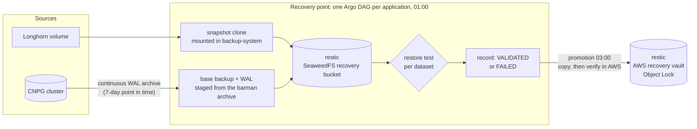

# Backup Architecture

**Status:** implemented as the recovery system ([ADR-012](adr/0012-recovery-system.md)), the only
backup system since the cutover on 2026-09-13. This page shows how it fits together. The ADR
records why it is built this way, and [the recovery runbook](runbooks/backup-recovery.md) covers
how to restore.

What has to be recoverable, and how well, is stated in one place:
[`37-backup-system/recovery-policy.yaml`](../cluster/base/infrastructure/37-backup-system/recovery-policy.yaml).

## What is protected

| Dataset | Application | Taken from |
|---|---|---|
| `immich-media` | Immich | its library volume, via a Longhorn snapshot clone |
| `immich-db` | Immich | its CNPG cluster: a base backup plus the WAL that makes it consistent |
| `paperless-media` | Paperless | its document volume, via a snapshot clone |
| `paperless-db` | Paperless | its SQLite database, copied with SQLite's online backup API on a clone |
| `keycloak-db` | Keycloak | its CNPG cluster |
| `filer-db` | SeaweedFS | the filer's CNPG cluster |

**Not protected, on purpose:**

- metrics, logs and traces, which are derived data;
- caches, including Zot's copies of upstream images;
- etcd (below).

**Not protected by accident:** a volume that holds real data but is not yet a dataset in the
policy. Nothing reports one yet (docs/backlog.md).

## How a recovery point is made

- **Nothing opens an application's namespace to take a backup.** Files and SQLite are read from a
  snapshot clone mounted in `backup-system`. PostgreSQL is archived by CNPG from inside the
  database pod.
- **A point counts only once it has been read back.**
  - Files are restored and checked against their hashes.
  - SQLite is integrity-checked, and the policy's restore checks are run against it.
  - Each PostgreSQL copy is recovered into a scratch cluster and queried.

  A point with any failed dataset is FAILED, and the previous validated point stays the one to
  restore.
- **Only validated points are promoted,** and each one is verified in AWS before its record says
  REMOTE_VERIFIED.
- **Records travel with the data.** Each point's JSON record sits in the repository bucket next to
  the data it describes, and is promoted with it, so a recovery from AWS alone can find it.
- **Retention thins each repository to its schedule behind two guards:**
  - a verification gate: it thins nothing whose newest point is unvalidated;
  - a dry-run cap: it refuses a plan that would remove too much.

  AWS deletes are delete markers under Object Lock.

## Schedule

| When | What |
|---|---|
| continuous | CNPG WAL archiving, a 7-day point-in-time window per database |
| 01:00 daily | recovery points, one Workflow per application |
| 03:00 daily | promotion to AWS |
| 04:00 daily | local retention: 7 daily, 3 weekly, 3 monthly |
| 04:30 Sundays | AWS retention: 1 weekly, 3 monthly |
| :30 hourly | the reconciler, which submits a recovery point or a promotion only when a guarantee is missed |
| 11:00 Sundays | the pre-upgrade gate, which authorises that day's Talos and Kubernetes upgrades only if every application has a restore-tested point with a verified AWS copy |

## What says it is working

| Signal | Fires when |
|---|---|
| RecoveryPointStale (critical) | a dataset has no validated point within 26 hours |
| RecoveryOffsiteStale (critical) | a dataset has no copy verified in AWS within 48 hours |
| RecoveryPointFailed | a point's backup, plausibility check or restore test failed |
| RecoveryPromotionRefused | promotion would push the vault past its cap |
| RecoveryRetentionHeld / Refused | retention's gate held a dataset, or its dry-run cap refused the plan |
| RecoveryRetentionStale | retention has not completed on schedule |
| RecoveryBackupUnusualGrowth, RecoveryLocalRepositoryOverCap | a backup grew unusually, or the local repository passed its cap |

Also: `python3 scripts/cluster-health.py --group backup`, and the upgrade gate's own verdict.

## Where the credentials live

- **Every backup-store credential is in `backup-system`, with one exception.** The barman-cloud
  plugin reads its object-store credential from the database's own namespace, so each namespace
  with a CNPG cluster holds the *local* store's credential. No application namespace holds an AWS
  credential.
- **AWS has two in-cluster identities:**
  - the promoter, which may write, and may delete only restic's own lock files;
  - retention, whose deletes are only delete markers on the versioned, Object-Lock bucket.

  An interactive admin, behind MFA, is the only identity that can remove a version (runbook A8).
- **The restic password encrypts both repositories.** It is escrowed off-site with the age key
  (runbook A8): without it, the AWS copy cannot be read.

## Deliberately out of scope: etcd

There is no etcd backup, and that is a decision rather than a gap. It is written here because it
has been rediscovered as a gap twice, once by reading a Talos API grant that outlived the workload
behind it.

`talos-backup` was deployed and removed (#327). It ran every six hours for 44 days, exited 0 every
time, took a real snapshot -- the logs record 219 MB -- and never uploaded it. Upstream has
published no release since the version that failed.

The cluster does not need it. The recovery system covers the applications' data, and everything
else in etcd is declared in Git and rebuilt by Flux. An etcd snapshot would make recovery faster,
not possible where it otherwise was not. `machine.features.kubernetesTalosAPIAccess` stays
disabled for the same reason.

## History

This page used to describe the pipeline the recovery system replaced: Longhorn backups and
database dumps in SeaweedFS, relayed one-way to an ADR-005 vault, with Velero for Kubernetes
objects. [ADR-005](adr/0005-two-stage-backup-relay.md), [ADR-010](adr/0010-backup-topology.md)
and [ADR-011](adr/0011-recovery-oriented-backup-policy.md) record it, and Git history has the
rest. It was removed at the cutover on 2026-09-13.

The lesson it left shaped what replaced it. The cluster once went 37 days with no working backup
of any persistent data while every job reported success. Later, backup objects listed at their
correct size and failed on read. Every failure was silent. So the recovery system counts nothing
as a backup until it has been restored and checked.
