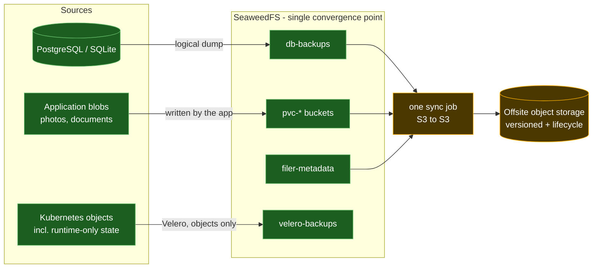
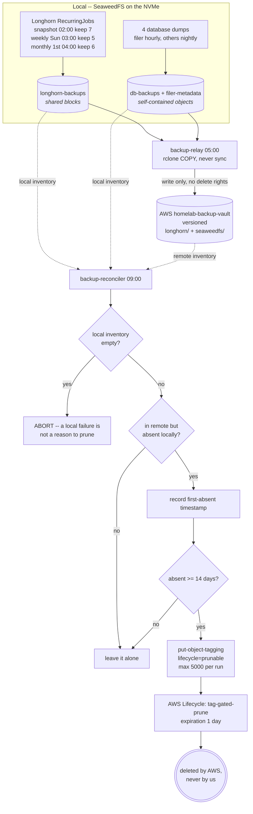

# Backup Architecture

**Status:** problem statement and target design. Partially implemented.
**Related:** [ADR-003](adr/0003-backup-immutability-versioning-only.md), [ADR-011](adr/0011-recovery-oriented-backup-policy.md), `docs/backlog.md`

What has to be recoverable, and how well, is stated in one place:
[`34-backup/backup-policy.yaml`](../cluster/base/infrastructure/34-backup/backup-policy.yaml), checked
against the mechanisms below by `scripts/check-backup-policy.py` on every build (ADR-011).

## Problem statement

**This cluster had no working backup of any persistent data for 37 days, and reported success
the entire time.**

Velero ran on schedule, produced backup objects, and shipped them to two storage locations.
Inspecting every `PodVolumeBackup` ever recorded showed the only volumes it had captured were
`dshm`, `tmp` and `empty-dir` — ephemeral scratch. Not one PersistentVolumeClaim. The cause
was two independent silent failures:

- Velero's file-system backup **skips hostPath volumes by design**. Every `local-path` PVC in
  this cluster is hostPath-backed, so no `PodVolumeBackup` was created at all. No error, no
  warning — the volume simply was not in the backup.
- On SeaweedFS CSI volumes a `PodVolumeBackup` *was* created and then **failed with an empty
  error message**, leaving a `PartiallyFailed` backup that looked like a transient glitch.

Two further faults compounded it, both self-inflicted and both invisible until looked for:

- A metadata backup job wrote into Velero's own S3 bucket. Velero rejects unknown top-level
  prefixes in its bucket and marked the `BackupStorageLocation` **Unavailable**, which fails
  every backup at validation. Sharing a bucket looked harmless and silently disabled the
  entire local backup target.
- The storage layer's FUSE mount daemon had no memory limit, inherited a 256Mi namespace
  default, and was OOM-killed under load. Every SeaweedFS volume on the node returned EIO at
  once. The symptom surfaced as application errors — an app returning 500s with database I/O
  errors — which points investigation away from storage.

The through-line is not that backups were misconfigured. It is that **every failure mode was
silent**, and several presented as something other than a backup problem. A backup system that
reports success while storing nothing is worse than none: it converts a known gap into a false
assurance, and it trains everyone to ignore the one alarm that should never be ignored.

### Secondary problem: no single component can cover this cluster

| Layer | Velero | SeaweedFS native | Logical dumps |
|---|---|---|---|
| Kubernetes objects | yes | no concept of them | no |
| Databases | hostPath skipped when on local-path | cannot see them | yes |
| Application blobs (SeaweedFS) | FUSE path fails | yes | no |

The recommended Kubernetes approach — CSI volume snapshots — is unavailable here: the
`snapshot.storage.k8s.io` CRDs are not installed, and the SeaweedFS CSI driver implements no
`CreateSnapshot` (the chart ships no `external-snapshotter` sidecar). That is why file-system
backup was in use at all, and it is the fallback that failed.

## Constraints

- **Homelab, not production.** Proportionality governs. Immutability was evaluated and
  declined in [ADR-003](adr/0003-backup-immutability-versioning-only.md); versioning plus
  lifecycle retention is the accepted offsite protection level.
- **Databases stay off FUSE.** PostgreSQL depends on POSIX `fsync` durability, which is not a
  safe assumption on a network FUSE filesystem, and the CSI mount service is documented
  upstream as not resilient to its own restarts. Keeping databases off SeaweedFS also means a
  total storage failure does not take out the identity provider needed to log in and repair it.

  This originally meant `local-path`, the only alternative at the time. Since
  [ADR-004](adr/0004-longhorn-v1-storage-engine.md) it means Longhorn, which presents an
  ordinary ext4 block device and so satisfies the same requirement without pinning a pod to
  one node or hiding the volume from every backup mechanism. The one deliberate exception is
  the SeaweedFS filer's own metadata database, which stays on `local-path` so that restoring
  SeaweedFS never depends on SeaweedFS.
- **Prefer few moving parts.** Every component is one more thing to maintain, and one more
  thing that can fail quietly.

## Target design

Everything that must survive converges into SeaweedFS through normal operation, and a single
job copies SeaweedFS offsite. Nothing traverses FUSE on the backup path.

**Why this shape**

- **Databases are dumped logically, never snapshotted.** A byte-level copy of a live database
  is crash-consistent, not a consistent backup. Dumps are also indifferent to the volume type
  underneath, which makes the hostPath problem irrelevant rather than worked around.
- **Blobs are already in SeaweedFS**, and — critically — **readable over the S3 API**. The CSI
  volumes are ordinary buckets, so the backup path uses a stable HTTP API instead of the FUSE
  mount that failed. The fragile component is removed from the backup path entirely.
- **Velero is reduced to what it alone can do**: the Kubernetes object graph, including the
  runtime-generated state Git does not hold — issued TLS secrets, PV binding identity,
  operator-created resources. With file-system backup off, its node-agent DaemonSet is removed;
  that pod ran as root with a hostPath mount of every pod's volumes on the node.
- **One job leaves the cluster.** Retention and point-in-time recovery come from the
  destination bucket's versioning and lifecycle rules, because SeaweedFS's own replication is a
  mirror and would faithfully propagate a deletion.

### What "all green" looks like

Health is defined by observable signals, not by the absence of complaints:

| Signal | Green |
|---|---|
| Velero backup phase | `Completed`, zero errors, zero warnings — never `PartiallyFailed` |
| `BackupStorageLocation` | both `Available` |
| Database dump jobs | complete daily; each artifact above its minimum-size guard |
| Artifact validity | dumps carry a valid header; SQLite passes `integrity_check` |
| Offsite sync | last run recent; object count and bytes non-decreasing |
| Mount daemon | zero restarts; memory well under limit |
| Restore drill | performed and passing, on a schedule |

The last row matters most and is the only one that proves the rest. Everything above it shows
that data was *written*; only a restore shows it can be *read back*.

## Current state

**Done**

- Logical dumps for Keycloak and Paperless into `db-backups`, each refusing to upload an
  implausibly small artifact. That guard immediately caught a real fault — a `pg_dump` major
  version mismatch producing a 20-byte file — which would otherwise have been stored as a
  successful backup containing nothing.
- Immich's database is dumped by Immich itself, daily and version-matched, into its own library
  volume. No second job is needed.
- Filer metadata dumped to its own bucket. Without it the blobs are anonymous and
  unrecoverable, which makes it the highest-value, smallest-volume target in the cluster.
- Velero reduced to objects only; node-agent DaemonSet removed.
- Application blobs on SeaweedFS and confirmed readable over S3.
- Alerting on mount-daemon restarts and memory, on filesystem capacity, and on OOM kills with
  the affected workload actually named.

**Outstanding**

- The offsite sync job. Everything converges into SeaweedFS today, but nothing yet copies
  SeaweedFS out of the cluster on a schedule.
- A restore drill. Artifacts are verified to decode; nothing has been restored.

**Deliberately out of scope: etcd**

There is no etcd backup, and that is a decision rather than a gap. It is written here because it
has now been rediscovered as a gap twice, once by reading a Talos API grant that outlived the
workload behind it.

`talos-backup` was deployed and removed (#327). It ran every six hours for 44 days, exited 0
every time, took a real snapshot — the logs record 219 MB — and never uploaded it. Reproduced on
demand before removal: a fresh run logged a 219,336,736-byte snapshot, exited 0 in seven seconds,
and the target bucket was still empty. Seven seconds is not long enough to compress, encrypt and
upload 219 MB, and no line about any of those steps is ever logged. Six preceding commits had
already fixed the plumbing — `USE_PATH_STYLE`, `hostAliases`, `workingDir`, `HOME`, the
talosconfig secret, the container security context — so the failure is in the tool, not the
configuration.

Upstream has published no release since: `v0.1.0-beta.2`, 2024-08-27, is still the latest and is
the exact version that failed. Redeploying it reproduces the failure.

The cluster does not need it. Velero covers the application namespaces, each database has its own
logical dump, and everything else in etcd is declared in git and rebuilt by Flux. What an etcd
snapshot would add is faster recovery, not recoverability.

`machine.features.kubernetesTalosAPIAccess` was removed from both overlays for the same reason:
it granted `os:etcd:backup` to a namespace that no longer exists, which reads as a live backup
path to anyone auditing the machine config. Re-enable it only alongside a workload proven to
actually upload — and prove that by reading the bucket, not the exit code. A job reporting
success while storing nothing is worse than no job.

## Upstream assessment

Checked whether the two structural limitations are likely to be fixed for us.

**Mount service restart resilience — acknowledged, not scheduled.** The limitation is stated by
the project itself, and the documented answer is the `OnDelete` update strategy: manual,
controlled recycles to avoid disrupting active mounts. That is a workaround, not a fix. Related
open issues describe adjacent failure modes, including a pod starting *without* its mount after
an initial mount error — the same silent-failure character seen here. Treat a mount-daemon
restart as an outage requiring manual recovery; that is the supported model, not a temporary
state.

**CSI snapshots — no evidence of planned support.** Nothing found in the driver's repository
indicates `CreateSnapshot` is coming. The recommended Velero path should be assumed unavailable
indefinitely, which is why this design routes around it via the S3 API rather than waiting.

**The operator is worth watching.** SeaweedFS ships a Kubernetes operator advertising scheduled
backup and restore with filer metadata snapshots plus continuous data mirroring to S3, GCS,
Azure, B2 or a PVC — close to the design above, packaged. Two cautions before counting on it:
some of that material appears on the commercial site, so the split between open-source and
Enterprise capability was not established here; and adopting it would replace the existing
Helm-based deployment, a larger change than the sync job it would displace. Worth re-checking
before building anything more elaborate than a sync job.

**No published open-source roadmap** was found. The assessment above is drawn from repository
documentation, issues and the project's own site rather than a roadmap document, so it
describes present state and stated intent, not commitments.

## Retention: how an object actually leaves the vault

This is the least obvious part of the design and the easiest to misread. Nothing in the vault
expires because it is old. **Retention is decided locally and mirrored remotely**, and the deletion
itself is performed by AWS, because no cluster credential is allowed to perform it.

### Why it is built this way

**The cluster can nominate, only AWS can delete.** The relay credential holds no
`s3:DeleteObject`; the reconciler's sole write against AWS is `put-object-tagging`. Tags, not
objects. An attacker holding every cluster credential can still not erase the vault -- the worst
they can do is mark objects, and the versioning and 14-day absence grace both sit in the way.

**The grace is measured on absence, not age.** An object deleted locally yesterday is a different
thing from one that has been gone a fortnight. `first-absent.tsv` records when each object was
first observed missing, so a transient local listing failure cannot cascade into remote deletion.

**An empty local inventory aborts the run.** A diff-driven pruner that reads the local side as
empty concludes that everything is prunable. That is the single most dangerous failure mode in
this design, and it is checked explicitly.

### What this means for backup formats

Because retention is local-state-driven rather than age-based, the vault imposes **no requirement
that stored objects be independent of one another**. Longhorn's backupstore is already a
reference-counted store of shared blocks: Longhorn prunes locally, where it owns the reference
graph and deletes are permitted, and the reconciler mirrors that absence.

Any deduplicating format would work the same way, which is worth stating plainly because the
opposite was assumed once and recorded as fact. The constraint that matters is not "objects must
be self-contained" -- it is "whatever prunes must do so locally, and must own its own reference
graph while doing it".
