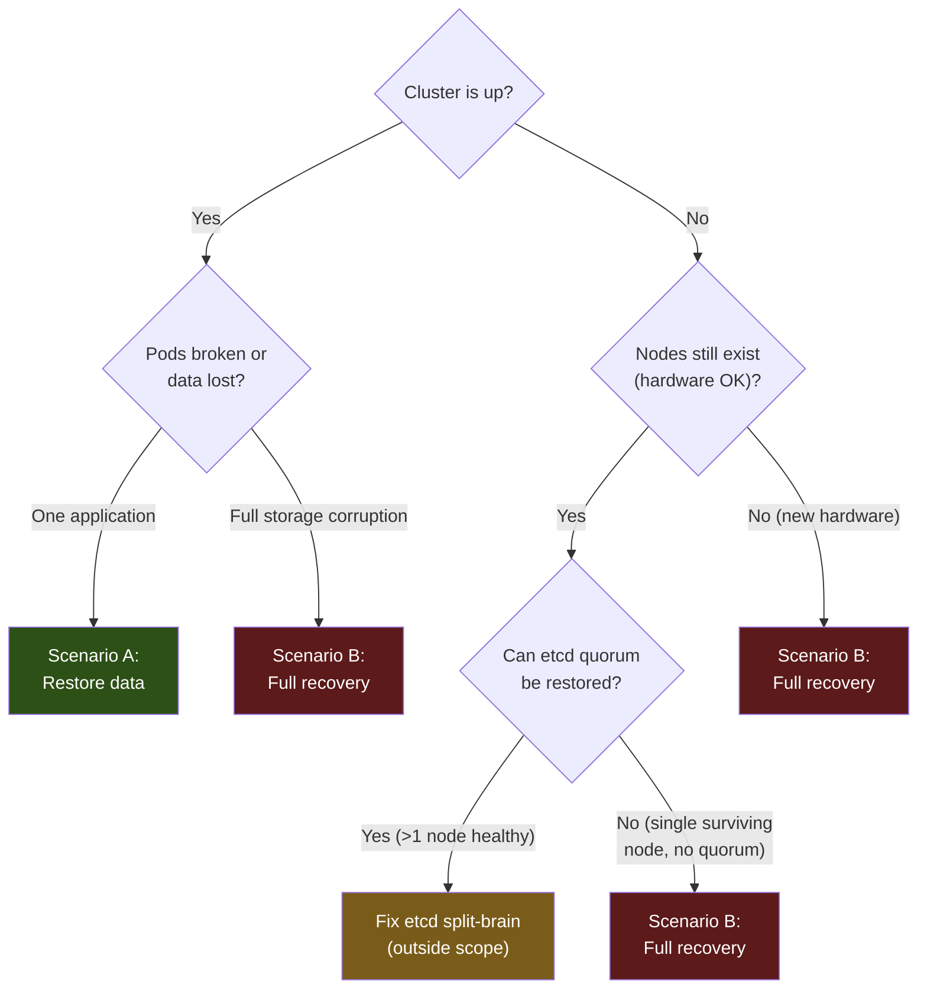

# Disaster Recovery

## Overview

This document covers recovery procedures for the Talos Kubernetes home lab. Read it to understand the process; where a scenario is automated, use `dr.py` to execute it.

Five recovery scenarios are covered. B is partly automated by `bootstrap/scripts/dr.py`;
the others are manual procedures.

| Scenario | When to use | Time estimate |
|---|---|---|
| **A — Restore application data** | A workload's data is broken or was accidentally deleted | 15–60 min |
| **B — Full cluster recovery** | Nodes are lost; rebuild from Git, data from the recovery system | not yet measured |
| **C — Add node** | Expanding from 1-node to 3-node, or replacing a failed node | 15–30 min |
| **D — Longhorn disk `NotReady`** | Every volume unschedulable after a node rebuild | 5 min |
| **E — Roll back Talos** | A Talos upgrade left the node broken or degraded | 5–20 min |

---

## Prerequisites

Before running any recovery, ensure you have the following items **offline** (never stored on the cluster or in git):

- [ ] **SOPS age private key** (`sops.age.key`) — decrypts all Git secrets
- [ ] **secrets bundle** (generated during bootstrap: `talosconfig`, `secrets.yaml`, and/or `controlplane.yaml`) — required for full cluster recovery
- [ ] **The recovery system's escrow** — the restic password and the vault's coordinates
      ([runbook A8](runbooks/backup-recovery.md)); the vault's AWS keys are in Git, SOPS-encrypted

Install required tools (or run `ansible-playbook ansible/bootstrap.yml` to install):

```bash
talosctl  kubectl  flux  sops  age  terraform  python3
```

---

## Network reachability — the recovery path

Every scenario below assumes you can still reach the node. Since the host firewall was
enforced (`cluster/base/infrastructure/10-network-policies/host-ingress.yaml`), that is no
longer a given, so it is worth stating plainly.

**Port 50000/TCP — the Talos API — is the only remote recovery path.** It is what
`talosctl` uses, and it is the only way to undo a mistake in the host firewall without
physical access to the machine — including reverting the firewall policy itself. If it is
unreachable and the Kubernetes API is also down, recovery requires a keyboard and monitor
attached to the node.

It is reachable from two source ranges only:

| range | what it is |
| --- | --- |
| `192.168.178.0/24` | the LAN |
| `100.64.0.0/10` | Tailscale (CGNAT range) |

`50001` (trustd) and `6443` (Kubernetes API) are scoped to the same two ranges. Everything
else on the host — etcd metrics `:2381`, node-exporter `:9100`, the Cilium metrics ports,
Hubble's peer service, and the controller-manager/scheduler metrics — is reachable only from
inside the cluster.

### Before narrowing those CIDRs

If a future change tightens either range, **confirm `talosctl` still answers before the change
stops being trivially revertible** — that is, while you still have a working `kubectl` to
delete the policy with:

```bash
talosctl version --short          # must return a Server tag
kubectl get ciliumclusterwidenetworkpolicy host-ingress
```

Losing both `50000` and `6443` at once is the failure that requires physical access. Losing
only `6443` is recoverable, because `talosctl` can still reach the node.

### If you are already locked out of Kubernetes

`talosctl` does not depend on the Kubernetes API, so it keeps working when `kubectl` does not:

```bash
talosctl version --short
talosctl service etcd
talosctl netstat --listening --tcp --programs
```

To remove the host firewall when `kubectl` is unavailable, the practical route is to restart
the Cilium agent through Talos and then delete the policy during the window before it is
re-applied — or, more reliably, revert the policy in git and let Flux reconcile it away.

### Changing this policy safely

Roll any edit through Cilium's audit mode first — it logs what *would* be dropped instead of
dropping it:

```bash
# host endpoint id comes from `cilium-dbg endpoint list` (look for reserved:host)
kubectl -n kube-system exec ds/cilium -c cilium-agent -- \
  cilium-dbg endpoint config <host-ep-id> PolicyAuditMode=Enabled

kubectl -n kube-system exec ds/cilium -c cilium-agent -- \
  cilium-dbg monitor --type policy-verdict | grep "action audit"
```

`action audit` marks a flow that would have been denied. Two real defects were found this way
when the policy was first rolled out, neither visible from reading the configuration.

**Audit mode does not survive a Cilium agent restart.** If the agent restarts mid-rollout, the
host endpoint switches to real enforcement with whatever policy is loaded at that moment.

---

## Decision Tree



---

## Scenario A — Restore application data

The cluster is up, and one application's data is broken or was deleted. Restore it from the
recovery system ([ADR-012](adr/0012-recovery-system.md)), following
[`runbooks/backup-recovery.md`, Part A](runbooks/backup-recovery.md):

| What | Section |
|---|---|
| Choose the recovery point to restore | A2 |
| Immich's photos, Paperless' documents | A3 |
| Paperless' database | A4 |
| A PostgreSQL database, to a point in time (last 7 days) or from a recovery point | A5 |
| Stopping the application while its data is replaced | A6 |

Every procedure was drilled on 2026-09-13 against the real repositories, into scratch targets.
Writing into a live volume or database has not been drilled; the runbook says where.

---

## Scenario B — Full Cluster Recovery

Rebuild the cluster from Git, then restore its data from the recovery system. This wipes all
nodes.

There is no etcd snapshot to restore, deliberately. Everything in etcd is declared in Git and
rebuilt by Flux, and application data comes from the recovery system's AWS vault. What is lost is
runtime-only state that Git does not describe. (A `talos-backup` CronJob once took etcd snapshots
and never uploaded one; it was removed on 2026-08-25.)

### Pre-flight checklist

- [ ] Offline SOPS age private key (`sops.age.key`)
- [ ] `secrets.yaml` (Talos secrets bundle generated at bootstrap)
- [ ] The recovery system's escrow: the restic password ([runbook A8](runbooks/backup-recovery.md))
- [ ] Node IP addresses (or DHCP-assigned addresses visible on network)

### Automated (recommended)

```bash
export SOPS_AGE_KEY_FILE=/path/to/sops.age.key

python3 bootstrap/scripts/dr.py full --profile 1-node --sops-age-key "$SOPS_AGE_KEY_FILE"
# 3-node: --profile 3-node --node1-ip ... --node2-ip ... --node3-ip ... --vip ...
```

| Phase | Action |
|---|---|
| 1 | Generate Talos machine configs from the original `secrets.yaml` |
| 2 | Apply machine configs to the nodes (wipes disks — confirmed interactively) |
| 3 | Bootstrap a fresh etcd |
| 4 | Retrieve the kubeconfig |
| 5 | Re-bootstrap Flux, which re-applies every cluster resource from Git |
| 6 | Suspend the recovery system's CronWorkflows, before any data is restored |
| 7 | Restore application data by hand: [runbook A7](runbooks/backup-recovery.md) |
| 8 | Verification |

**Phase 6 is not optional.** A rebuilt, still-empty application passes its own restore checks,
and the next scheduled point would promote it to AWS, where retention could then thin the last
good point away. Resume the schedules only once every application is back.

### Manual fallback

Phases 1, 2 and 4 are plain `talosctl gen config`, `talosctl apply-config --insecure` and
`talosctl kubeconfig`, as in the script. Bootstrap etcd without a snapshot:

```bash
talosctl bootstrap --talosconfig .talos/talosconfig --nodes ${NODE1_IP}
talosctl health --talosconfig .talos/talosconfig --nodes ${NODE1_IP}
```

Re-bootstrap Flux as in [Bootstrap](../README.md), and wait for the Kustomizations and
HelmReleases to become Ready. Then pause the schedules and restore the data following
[runbook A7](runbooks/backup-recovery.md), which gives the order and the commands.

---

## Scenario C — Add Node

Add a new node to an existing 3-node cluster, or replace a failed node.

### Automated (recommended)

```bash
export SOPS_AGE_KEY_FILE=/path/to/sops.age.key
export NEW_NODE_IP=192.168.1.13

python3 scripts/dr.py add-node
```

The script:
1. Generates a machine config for the new node using the original `secrets.yaml`
2. Applies the config (`--insecure` — no bootstrap flag)
3. Waits for the new node to join etcd and the API server
4. Verifies etcd membership count
5. Runs `volume.balance` to redistribute SeaweedFS data

### Manual fallback

```bash
# Generate config for the new node (same secrets — NO new bootstrap)
talosctl gen config homelab https://${VIP}:6443 \
  --with-secrets secrets.yaml \
  --output .talos/ \
  --force

# Apply to new node only — DO NOT run 'talosctl bootstrap'
talosctl apply-config --insecure --nodes ${NEW_NODE_IP} --file .talos/controlplane.yaml

# Wait for it to join
talosctl health --talosconfig .talos/talosconfig --nodes ${VIP}

# Verify etcd membership
talosctl etcd members --talosconfig .talos/talosconfig --nodes ${NODE1_IP}

# Rebalance SeaweedFS volumes
kubectl exec -n seaweedfs seaweedfs-master-0 -- weed shell <<'EOF'
volume.balance -force
EOF
```

---

## Scenario D — Longhorn disk `NotReady` after a node rebuild

Longhorn identifies a disk by a UUID it writes into a marker file on the disk itself, not by
its path. The `Node` CR records the UUID it expects; the disk carries its own copy in
`longhorn-disk.cfg`. If the two disagree — or the marker file is lost, which a node reset or
a re-created mount will do — Longhorn treats the path as an unknown disk rather than the one
it has replicas on. The disk goes `Ready: False`, every volume becomes unschedulable, and
each PVC fails to attach with no indication that the cause is a missing identifier.

Current values for the 1-node cluster:

| Field | Value |
|---|---|
| Disk name | `default-disk-1030300000000` |
| Path | `/var/mnt/longhorn0` |
| Disk UUID | `6fc50190-bb50-4273-8e65-0763b1cfc77e` |

Read the expected UUID back from the cluster rather than this table when the cluster is up —
the table is for when it is not:

```bash
kubectl get nodes.longhorn.io -n longhorn-system -o json \
  | jq -r '.items[].status.diskStatus | to_entries[] | "\(.key) \(.value.diskUUID)"'
```

Repair by writing the expected UUID back into the marker file on the node, then letting
Longhorn re-evaluate:

```bash
# on the node, via a privileged pod or talosctl
echo '{"diskUUID":"6fc50190-bb50-4273-8e65-0763b1cfc77e"}' > /var/mnt/longhorn0/longhorn-disk.cfg
```

The disk returns to `Ready: True` / `Schedulable: True` without restarting anything. Confirm
both conditions before assuming volumes will attach — `Ready` alone is not sufficient.

> Do **not** resolve this by adding a new disk or removing the old one from the `Node` CR.
> Longhorn would schedule new, empty replicas and the existing replica data on that path
> becomes unreferenced.
---

## Scenario E — Roll back a Talos version

Two routes with genuinely different properties. Pick on the basis of what is
still working, not on which is tidier.

| | `talosctl rollback` | lower the pin, let SUC run |
|---|---|---|
| mechanism | swaps the active boot entry (A/B) | installs a fresh image, reboots |
| downloads | none | pulls the installer image |
| target | **only the previous install** | any version the Factory can build |
| repeatable | single-shot | yes |
| extensions | inherited from that install | whatever the image carries |
| depends on | the Talos API, port 50000 | Kubernetes + SUC + a schedulable Job + registry + Flux |
| recorded in git | no | yes, guarded |

Neither touches Kubernetes. Rolling back Talos leaves the Kubernetes version
exactly where it was.

### E1 — Emergency: `talosctl rollback`

Use when the cluster is degraded, because this path needs almost nothing:
no registry, no Kubernetes scheduler, no SUC, no Flux. That matters precisely
when a bad Talos upgrade has broken one of them — on 2026-08-26 an upgrade took
out DNS and left the apiserver advertising a dead IP, and every Kubernetes-based
recovery route was unavailable.

```bash
# What is running now, and what the config says it should be
talosctl version --short
kubectl get nodes -o wide

talosctl rollback --nodes 192.168.178.100
```

Then wait for the node to come back and confirm:

```bash
talosctl version --short          # expect the PREVIOUS version
talosctl health --talosconfig .talos/talosconfig
kubectl get nodes                 # Ready
kubectl get volumes.longhorn.io -n longhorn-system   # attached, not faulted
```

**Three things to know before relying on this.**

It is **single-shot**. It reverts to the *previous* install, so after two
upgrades the other partition holds the second-newest image, not your
last-known-good. There is no `--to`.

**You cannot query what it will give you.** `bootstatus` and `upgradestatus` are
not registered resources on Talos v1.13.x, so nothing reports the contents of
the inactive partition. You are relying on knowing your own upgrade history.
Record every Talos upgrade somewhere durable for this reason.

**It creates drift that SUC will not notice.** After a rollback git still pins
the newer version, and SUC tracks completion by *plan hash on the node label*
rather than by the running version — so the node keeps its
`plan.upgrade.cattle.io/talos-controlplane` label, SUC concludes there is nothing
to do, and the cluster sits on the old version while the mechanism believes it is
current. What catches this is `talos-fleet-health`, which compares desired
against running and emits `talos_fleet_version_drift`.

So finish the job:

```bash
# Make git agree with reality, or the drift persists silently
#   1. lower TALOS_VERSION in versions.env to the version now running
#   2. open a PR, apply the confirmed-downgrade label, merge
# See E2 for the details.
```

### E2 — Planned: lower the pin and let SUC run

Use for a deliberate, reviewable move while the cluster is healthy. The whole
path already exists; nothing needs building.

```bash
git checkout -b bug/talos-rollback-to-<version>
# edit ONLY this file -- Kustomize replacements propagate the value into all
# four Plans and the machine configs, so editing them by hand causes drift
$EDITOR cluster/base/infrastructure/15-system-upgrade-controller/config/versions.env
#   TALOS_VERSION=v1.13.6        (or KUBERNETES_VERSION for a k8s move)

gh pr create --base ops/talos_linux --title "bug(talos): roll back to v1.13.6" --body "..."
gh pr edit <n> --add-label confirmed-downgrade
```

The `confirmed-downgrade` label is **required**. `guard-downgrade` compares
`TALOS_VERSION` and `KUBERNETES_VERSION` against the base branch, sorts them with
`sort -V`, and fails the PR on any decrease without it. That is deliberate: a
downgrade should never be something a Renovate PR or a careless edit can do
quietly.

Three other CI checks run on the same PR and are worth understanding, because
each has caught a real fault here:

- **every pin agrees** — the version appears in nine places across five files;
  a partial edit installs something other than what the machine config declares.
- **the schematic ID matches `schematic.yaml`** — the ID is a content hash of
  the extension list, so a stale one silently deploys the wrong extension set.
- **the Factory image exists** — the Factory builds per (schematic, version), and
  extensions are published per Talos version. An older version's image with this
  schematic may simply not exist, in which case the upgrade Job pulls a 404 and
  leaves the node cordoned mid-plan. This check is the reason to find that out in
  CI rather than at 03:00.

After merge, the rollback runs at the next window — or immediately, via the
label:

```bash
kubectl label node talos-1ps-0l8 talos.homelab/upgrade-now=""     # arm
kubectl get jobs -n cattle-system -w
kubectl label node talos-1ps-0l8 talos.homelab/upgrade-now-       # DISARM
```

Note the scheduled Plans additionally require `talos.homelab/upgrade-ready`,
which `upgrade-backup-gate` sets at 11:00 on Sunday only after proving the
backups are recent and readable. `talos-on-demand` deliberately does not, so it
remains usable when the gate is refusing — which is a likely state during an
incident.

### Why E2 is not a substitute for E1

`talosctl upgrade` to an older release is a *different operation* from reverting
a boot entry, with different guarantees. Talos does not support arbitrary
downgrades: the META format and etcd schema move between versions, so an older
release may refuse the config it is handed or start badly. `rollback` is
explicitly supported for the immediately-previous install because that install
already ran on this machine with this config.

E2 also depends on the control plane it may be trying to repair — Kubernetes must
schedule a Job, SUC must be running, the registry must be reachable, and Flux
must have applied the merge. A bad upgrade can break any of them.

And E2 must use the **Factory** installer with the correct schematic. The stock
`ghcr.io/siderolabs/installer` carries no extensions, so a rollback through it
silently drops `iscsi-tools` and `util-linux-tools`, and Longhorn loses iSCSI
attach on the next boot. `rollback` cannot make this mistake, because it installs
nothing.

### Known expiry

The Talos Plans pass `--preserve=true`, which is deprecated:

```
Flag --preserve has been deprecated, legacy flag for MachineService.Upgrade
fallback, to be removed in Talos 1.18
```

It is accepted through the 1.13-1.17 line. At Talos 1.18 the flag stops existing
and the Plans break, so it must be removed from all three Talos Plans before
that pin is raised.


---

## Scenario F — Restore a PostgreSQL database

The per-database logical dumps this section used to describe ended at the ADR-012 cutover
(2026-09-13). Every PostgreSQL database -- `keycloak-pg`, `immich-pg` and `filer-meta-pg` -- is
now restored from the recovery system: to any point in the last 7 days from its WAL archive, or
from a recovery point, including after total loss from AWS alone. See
[`runbooks/backup-recovery.md`, A5](runbooks/backup-recovery.md).

The prerequisites that the 2026-09-09 dump drill found -- the owner role, Immich's `vchord`
preload and matching image, and an authorised S3 client -- are built into those procedures.

## Post-Recovery Verification Checklist

After any recovery scenario, verify the following:

```bash
# Cluster health
kubectl get nodes
talosctl health --talosconfig .talos/talosconfig

# Flux reconciliation
kubectl get kustomizations -A
kubectl get helmreleases -A

# Storage
kubectl get pods -n seaweedfs

# Monitoring
kubectl get pods -n monitoring
kubectl get pods -n grafana

# Network policies (Cilium)
kubectl get ciliumclusterwidenetworkpolicies

# Certificates
kubectl get certificates -A

# The recovery system (resume its schedules first, if Scenario B paused them)
kubectl get cronworkflows -n backup-system
python3 scripts/cluster-health.py --group backup
```

Expected healthy state:
- All nodes `Ready`
- All HelmReleases `Ready: True`
- `cluster-health.py --group backup` passes: every application has a validated recovery point
  and a verified copy in AWS

---

## Timeline Estimates

| Scenario | Minimum | Expected | Maximum |
|---|---|---|---|
| Restore one application's data | 15 min | 30 min | 60 min |
| Full cluster recovery | not yet measured | | |
| Add node | 10 min | 20 min | 30 min |

Full recovery time depends heavily on Flux reconciliation time (HelmRelease downloads) and on how much
data comes back from AWS. The total-loss drill that would measure it has not been run.

---

## Key File Locations

| Item | Location |
|---|---|
| DR automation script | `bootstrap/scripts/dr.py` |
| Bootstrap scripts | `bootstrap/scripts/bootstrap-1node.sh`, `bootstrap/scripts/bootstrap-3node.sh` |
| Cluster overlays | `cluster/overlays/1-node/`, `cluster/overlays/3-node/` |
| SOPS config | `.sops.yaml` |
| Terraform (AWS) | `bootstrap/terraform/` |
| AWS provisioning | `bootstrap/scripts/setup-aws.sh` |
| Secret rotation | `bootstrap/scripts/rotate-secrets.py` |
| Recovery runbook | `docs/runbooks/backup-recovery.md` |
