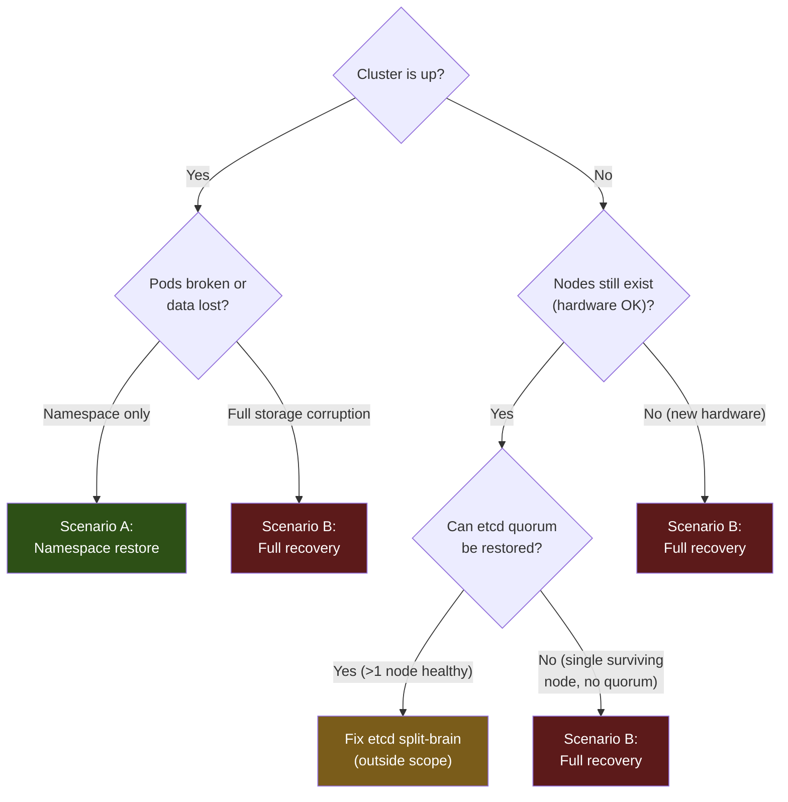

# Disaster Recovery

## Overview

This document covers recovery procedures for the Talos Kubernetes home lab. Read it to understand the process; where a scenario is automated, use `dr.py` to execute it.

Five recovery scenarios are covered. A and B are automated via `scripts/dr.py`;
C, D and E are manual procedures.

| Scenario | When to use | Time estimate |
|---|---|---|
| **A — Namespace restore** | A workload is broken or data was accidentally deleted | 5–20 min |
| **B — Full cluster recovery** | Nodes are lost; cluster cannot be rebuilt from scratch | 30–60 min |
| **C — Add node** | Expanding from 1-node to 3-node, or replacing a failed node | 15–30 min |
| **D — Longhorn disk `NotReady`** | Every volume unschedulable after a node rebuild | 5 min |
| **E — Roll back Talos** | A Talos upgrade left the node broken or degraded | 5–20 min |

---

## Prerequisites

Before running any recovery, ensure you have the following items **offline** (never stored on the cluster or in git):

- [ ] **SOPS age private key** (`sops.age.key`) — decrypts all Git secrets
- [ ] ~~**talos-backup age private key** (`talos-backup.age.key`)~~ — decrypted etcd
      snapshots. No longer required: no snapshots exist. See Scenario B.
- [ ] **secrets bundle** (generated during bootstrap: `talosconfig`, `secrets.yaml`, and/or `controlplane.yaml`) — required for full cluster recovery
- [ ] **AWS credentials** — to fetch offsite etcd snapshots from S3 (full recovery only)

Install required tools (or run `ansible-playbook ansible/bootstrap.yml` to install):

```bash
talosctl  kubectl  flux  sops  age  terraform  python3
```

---

## Decision Tree



---

## Scenario A — Namespace Restore

Restore a single namespace from the most recent Velero backup. Cluster must be running.

### Automated (recommended)

```bash
export SOPS_AGE_KEY_FILE=/path/to/sops.age.key

python3 scripts/dr.py namespace
```

The script:
1. Lists available Velero backups and lets you choose one
2. Triggers `velero restore` for the selected namespace
3. Polls until the restore is complete
4. Runs a basic readiness check on the restored pods

### Manual fallback

```bash
# List available backups
velero backup get

# Restore a specific namespace from a backup
velero restore create --from-backup <backup-name> \
  --include-namespaces <namespace> \
  --wait

# Check restore status
velero restore get
kubectl get pods -n <namespace>
```

---

## Scenario B — Full Cluster Recovery

Rebuild the cluster from scratch using an etcd snapshot. This wipes all nodes.

> **This scenario cannot currently be executed. There are no etcd snapshots to recover
> from, and there never have been.**
>
> A `talos-backup` CronJob ran every six hours for 44 days and exited 0 every time. It
> took the snapshot — the logs record a real one, 219 MB — and then never uploaded it.
> The `etcd-backups` bucket it targeted holds zero objects, confirmed with the SeaweedFS
> admin credential, and the AWS `homelab-etcd-backups-offsite` bucket that phases 3–5
> below read from has no mechanism writing to it at all. The CronJob was removed on
> 2026-08-25 rather than left reporting success.
>
> The steps below are kept because the *procedure* is correct and the only missing
> ingredient is the snapshot. If etcd backups are reinstated, this works again as
> written. Until then, treat phases 3–5 as unavailable.
>
> **What recovery does exist.** Everything except cluster identity is covered by
> [ADR-005](adr/0005-two-stage-backup-relay.md): Longhorn volume backups and database
> dumps, relayed to an immutable off-site vault and verified nightly. A rebuild without
> an etcd snapshot means re-provisioning Talos from `secrets.yaml`, letting Flux
> reconstruct every cluster resource from Git, and restoring data from those backups.
> What is lost is runtime-only state that Git does not describe.

### Pre-flight checklist

- [ ] Offline SOPS age private key (`sops.age.key`)
- [ ] ~~Offline talos-backup age private key (`talos-backup.age.key`)~~ — see the note
      above; phases 3–5 cannot run
- [ ] `secrets.yaml` (Talos secrets bundle generated at bootstrap)
- [ ] AWS credentials with read access to the etcd-backups S3 bucket
- [ ] Node IP addresses (or DHCP-assigned addresses visible on network)

### Automated (recommended)

```bash
export SOPS_AGE_KEY_FILE=/path/to/sops.age.key
export AWS_ACCESS_KEY_ID=<key>
export AWS_SECRET_ACCESS_KEY=<secret>
export AWS_REGION=<region>

# For 3-node:
export NODE1_IP=192.168.1.10
export NODE2_IP=192.168.1.11
export NODE3_IP=192.168.1.12
export VIP=192.168.1.100

# For 1-node:
export NODE_IP=192.168.1.10
export PRIMARY_DISK=/dev/sda
export BACKUP_DISK=/dev/sdb

python3 scripts/dr.py full
```

The script executes 9 phases:

| Phase | Action |
|---|---|
| 1 | Generate Talos machine configs from original `secrets.yaml` |
| 2 | Apply machine configs to nodes (wipes disks — confirmed interactively) |
| 3 | Fetch latest etcd snapshot from AWS S3 |
| 4 | Decrypt snapshot with talos-backup age key |
| 5 | Bootstrap etcd recovery with `talosctl bootstrap --recover-from` |
| 6 | Retrieve kubeconfig and wait for API server |
| 7 | Re-bootstrap Flux (re-applies all cluster resources from Git) |
| 8 | Re-create SeaweedFS buckets (idempotent) |
| 9 | Restore Velero backups (latest schedule snapshot) |

### Manual fallback (phase-by-phase)

**Phase 1: Regenerate Talos configs**

```bash
talosctl gen config homelab https://${VIP}:6443 \
  --with-secrets secrets.yaml \
  --output .talos/ \
  --force
```

**Phase 2: Apply configs and wipe nodes**

```bash
# WARNING: This wipes all data on the node.
talosctl apply-config --insecure --nodes ${NODE1_IP} --file .talos/controlplane.yaml
talosctl apply-config --insecure --nodes ${NODE2_IP} --file .talos/controlplane.yaml
talosctl apply-config --insecure --nodes ${NODE3_IP} --file .talos/controlplane.yaml
```

**Phase 3–4: Fetch and decrypt etcd snapshot**

```bash
# List available snapshots (newest first)
aws s3 ls s3://<cluster>-etcd-backups-offsite/ --recursive | sort -r | head -5

# Download the latest snapshot
aws s3 cp s3://<cluster>-etcd-backups-offsite/<latest-snapshot>.age /tmp/etcd.age

# Decrypt
AGE_SECRET_KEY=$(cat /path/to/talos-backup.age.key) \
  age --decrypt -i /path/to/talos-backup.age.key /tmp/etcd.age > /tmp/etcd.snapshot
```

**Phase 5: Bootstrap etcd recovery**

```bash
talosctl bootstrap \
  --talosconfig .talos/talosconfig \
  --nodes ${NODE1_IP} \
  --recover-from /tmp/etcd.snapshot
```

Wait for the cluster to come up (allow 2–5 minutes):

```bash
talosctl health --talosconfig .talos/talosconfig --nodes ${NODE1_IP}
```

**Phase 6: Retrieve kubeconfig**

```bash
talosctl kubeconfig --talosconfig .talos/talosconfig --nodes ${NODE1_IP} ~/.kube/config
kubectl get nodes
```

**Phase 7: Re-bootstrap Flux**

```bash
flux bootstrap github \
  --owner=${GITHUB_OWNER} \
  --repository=${GITHUB_REPO} \
  --path=cluster/overlays/3-node \
  --personal
```

Wait for Flux to reconcile all HelmReleases (allow 10–15 minutes):

```bash
kubectl get helmreleases -A
kubectl get kustomizations -A
```

**Phase 8: Re-create SeaweedFS buckets**

The `seaweedfs-bucket-init` Job runs automatically via Flux. If it needs to be re-triggered:

```bash
kubectl delete job seaweedfs-bucket-init -n seaweedfs
# Flux re-creates it on the next reconciliation
flux reconcile kustomization flux-system
```

**Phase 9: Velero restore**

```bash
# List available backups
velero backup get

# Restore all namespaces from the latest scheduled backup
velero restore create --from-backup <latest-backup> --wait
```

---

## Scenario C — Add Node

Add a new node to an existing 3-node cluster, or replace a failed node.

### Automated (recommended)

```bash
export SOPS_AGE_KEY_FILE=/path/to/sops.age.key
export NEW_NODE_IP=192.168.1.13

python3 scripts/dr.py add-node
```

The script:
1. Generates a machine config for the new node using the original `secrets.yaml`
2. Applies the config (`--insecure` — no bootstrap flag)
3. Waits for the new node to join etcd and the API server
4. Verifies etcd membership count
5. Runs `volume.balance` to redistribute SeaweedFS data

### Manual fallback

```bash
# Generate config for the new node (same secrets — NO new bootstrap)
talosctl gen config homelab https://${VIP}:6443 \
  --with-secrets secrets.yaml \
  --output .talos/ \
  --force

# Apply to new node only — DO NOT run 'talosctl bootstrap'
talosctl apply-config --insecure --nodes ${NEW_NODE_IP} --file .talos/controlplane.yaml

# Wait for it to join
talosctl health --talosconfig .talos/talosconfig --nodes ${VIP}

# Verify etcd membership
talosctl etcd members --talosconfig .talos/talosconfig --nodes ${NODE1_IP}

# Rebalance SeaweedFS volumes
kubectl exec -n seaweedfs seaweedfs-master-0 -- weed shell <<'EOF'
volume.balance -force
EOF
```

---

## Scenario D — Longhorn disk `NotReady` after a node rebuild

Longhorn identifies a disk by a UUID it writes into a marker file on the disk itself, not by
its path. The `Node` CR records the UUID it expects; the disk carries its own copy in
`longhorn-disk.cfg`. If the two disagree — or the marker file is lost, which a node reset or
a re-created mount will do — Longhorn treats the path as an unknown disk rather than the one
it has replicas on. The disk goes `Ready: False`, every volume becomes unschedulable, and
each PVC fails to attach with no indication that the cause is a missing identifier.

Current values for the 1-node cluster:

| Field | Value |
|---|---|
| Disk name | `default-disk-1030300000000` |
| Path | `/var/mnt/longhorn0` |
| Disk UUID | `6fc50190-bb50-4273-8e65-0763b1cfc77e` |

Read the expected UUID back from the cluster rather than this table when the cluster is up —
the table is for when it is not:

```bash
kubectl get nodes.longhorn.io -n longhorn-system -o json \
  | jq -r '.items[].status.diskStatus | to_entries[] | "\(.key) \(.value.diskUUID)"'
```

Repair by writing the expected UUID back into the marker file on the node, then letting
Longhorn re-evaluate:

```bash
# on the node, via a privileged pod or talosctl
echo '{"diskUUID":"6fc50190-bb50-4273-8e65-0763b1cfc77e"}' > /var/mnt/longhorn0/longhorn-disk.cfg
```

The disk returns to `Ready: True` / `Schedulable: True` without restarting anything. Confirm
both conditions before assuming volumes will attach — `Ready` alone is not sufficient.

> Do **not** resolve this by adding a new disk or removing the old one from the `Node` CR.
> Longhorn would schedule new, empty replicas and the existing replica data on that path
> becomes unreferenced.
---

## Scenario E — Roll back a Talos version

Two routes with genuinely different properties. Pick on the basis of what is
still working, not on which is tidier.

| | `talosctl rollback` | lower the pin, let SUC run |
|---|---|---|
| mechanism | swaps the active boot entry (A/B) | installs a fresh image, reboots |
| downloads | none | pulls the installer image |
| target | **only the previous install** | any version the Factory can build |
| repeatable | single-shot | yes |
| extensions | inherited from that install | whatever the image carries |
| depends on | the Talos API, port 50000 | Kubernetes + SUC + a schedulable Job + registry + Flux |
| recorded in git | no | yes, guarded |

Neither touches Kubernetes. Rolling back Talos leaves the Kubernetes version
exactly where it was.

### E1 — Emergency: `talosctl rollback`

Use when the cluster is degraded, because this path needs almost nothing:
no registry, no Kubernetes scheduler, no SUC, no Flux. That matters precisely
when a bad Talos upgrade has broken one of them — on 2026-08-26 an upgrade took
out DNS and left the apiserver advertising a dead IP, and every Kubernetes-based
recovery route was unavailable.

```bash
# What is running now, and what the config says it should be
talosctl version --short
kubectl get nodes -o wide

talosctl rollback --nodes 192.168.178.100
```

Then wait for the node to come back and confirm:

```bash
talosctl version --short          # expect the PREVIOUS version
talosctl health --talosconfig .talos/talosconfig
kubectl get nodes                 # Ready
kubectl get volumes.longhorn.io -n longhorn-system   # attached, not faulted
```

**Three things to know before relying on this.**

It is **single-shot**. It reverts to the *previous* install, so after two
upgrades the other partition holds the second-newest image, not your
last-known-good. There is no `--to`.

**You cannot query what it will give you.** `bootstatus` and `upgradestatus` are
not registered resources on Talos v1.13.x, so nothing reports the contents of
the inactive partition. You are relying on knowing your own upgrade history.
Record every Talos upgrade somewhere durable for this reason.

**It creates drift that SUC will not notice.** After a rollback git still pins
the newer version, and SUC tracks completion by *plan hash on the node label*
rather than by the running version — so the node keeps its
`plan.upgrade.cattle.io/talos-controlplane` label, SUC concludes there is nothing
to do, and the cluster sits on the old version while the mechanism believes it is
current. What catches this is `talos-fleet-health`, which compares desired
against running and emits `talos_fleet_version_drift`.

So finish the job:

```bash
# Make git agree with reality, or the drift persists silently
#   1. lower TALOS_VERSION in versions.env to the version now running
#   2. open a PR, apply the confirmed-downgrade label, merge
# See E2 for the details.
```

### E2 — Planned: lower the pin and let SUC run

Use for a deliberate, reviewable move while the cluster is healthy. The whole
path already exists; nothing needs building.

```bash
git checkout -b bug/talos-rollback-to-<version>
# edit ONLY this file -- Kustomize replacements propagate the value into all
# four Plans and the machine configs, so editing them by hand causes drift
$EDITOR cluster/base/infrastructure/15-system-upgrade-controller/config/versions.env
#   TALOS_VERSION=v1.13.6        (or KUBERNETES_VERSION for a k8s move)

gh pr create --base ops/talos_linux --title "bug(talos): roll back to v1.13.6" --body "..."
gh pr edit <n> --add-label confirmed-downgrade
```

The `confirmed-downgrade` label is **required**. `guard-downgrade` compares
`TALOS_VERSION` and `KUBERNETES_VERSION` against the base branch, sorts them with
`sort -V`, and fails the PR on any decrease without it. That is deliberate: a
downgrade should never be something a Renovate PR or a careless edit can do
quietly.

Three other CI checks run on the same PR and are worth understanding, because
each has caught a real fault here:

- **every pin agrees** — the version appears in nine places across five files;
  a partial edit installs something other than what the machine config declares.
- **the schematic ID matches `schematic.yaml`** — the ID is a content hash of
  the extension list, so a stale one silently deploys the wrong extension set.
- **the Factory image exists** — the Factory builds per (schematic, version), and
  extensions are published per Talos version. An older version's image with this
  schematic may simply not exist, in which case the upgrade Job pulls a 404 and
  leaves the node cordoned mid-plan. This check is the reason to find that out in
  CI rather than at 03:00.

After merge, the rollback runs at the next window — or immediately, via the
label:

```bash
kubectl label node talos-1ps-0l8 talos.homelab/upgrade-now=""     # arm
kubectl get jobs -n cattle-system -w
kubectl label node talos-1ps-0l8 talos.homelab/upgrade-now-       # DISARM
```

Note the scheduled Plans additionally require `talos.homelab/upgrade-ready`,
which `upgrade-backup-gate` sets at 11:00 on Sunday only after proving the
backups are recent and readable. `talos-on-demand` deliberately does not, so it
remains usable when the gate is refusing — which is a likely state during an
incident.

### Why E2 is not a substitute for E1

`talosctl upgrade` to an older release is a *different operation* from reverting
a boot entry, with different guarantees. Talos does not support arbitrary
downgrades: the META format and etcd schema move between versions, so an older
release may refuse the config it is handed or start badly. `rollback` is
explicitly supported for the immediately-previous install because that install
already ran on this machine with this config.

E2 also depends on the control plane it may be trying to repair — Kubernetes must
schedule a Job, SUC must be running, the registry must be reachable, and Flux
must have applied the merge. A bad upgrade can break any of them.

And E2 must use the **Factory** installer with the correct schematic. The stock
`ghcr.io/siderolabs/installer` carries no extensions, so a rollback through it
silently drops `iscsi-tools` and `util-linux-tools`, and Longhorn loses iSCSI
attach on the next boot. `rollback` cannot make this mistake, because it installs
nothing.

### Known expiry

The Talos Plans pass `--preserve=true`, which is deprecated:

```
Flag --preserve has been deprecated, legacy flag for MachineService.Upgrade
fallback, to be removed in Talos 1.18
```

It is accepted through the 1.13-1.17 line. At Talos 1.18 the flag stops existing
and the Plans break, so it must be removed from all three Talos Plans before
that pin is raised.


---

## Post-Recovery Verification Checklist

After any recovery scenario, verify the following:

```bash
# Cluster health
kubectl get nodes
talosctl health --talosconfig .talos/talosconfig

# Flux reconciliation
kubectl get kustomizations -A
kubectl get helmreleases -A

# Storage
kubectl get pods -n seaweedfs
velero backup-location get
velero backup get | head -5

# Monitoring
kubectl get pods -n monitoring
kubectl get pods -n grafana

# Network policies (Cilium)
kubectl get ciliumclusterwidenetworkpolicies

# Certificates
kubectl get certificates -A

# Scheduled backups
kubectl get cronjobs -n talos-backup
velero schedule get
```

Expected healthy state:
- All nodes `Ready`
- All HelmReleases `Ready: True`
- Velero backup-location shows `Available`
- talos-backup CronJob active

---

## Timeline Estimates

| Scenario | Minimum | Expected | Maximum |
|---|---|---|---|
| Namespace restore | 5 min | 10 min | 20 min |
| Full cluster recovery | 30 min | 45 min | 90 min |
| Add node | 10 min | 20 min | 30 min |

Full recovery time depends heavily on Flux reconciliation time (HelmRelease downloads) and Velero restore size.

---

## Key File Locations

| Item | Location |
|---|---|
| DR automation script | `scripts/dr.py` |
| Bootstrap scripts | `scripts/bootstrap-1node.sh`, `scripts/bootstrap-3node.sh` |
| Cluster overlays | `cluster/overlays/1-node/`, `cluster/overlays/3-node/` |
| SOPS config | `.sops.yaml` |
| Terraform (AWS) | `terraform/` |
| AWS provisioning | `scripts/setup-aws.sh` |
| Secret rotation | `scripts/rotate-secrets.py` |
