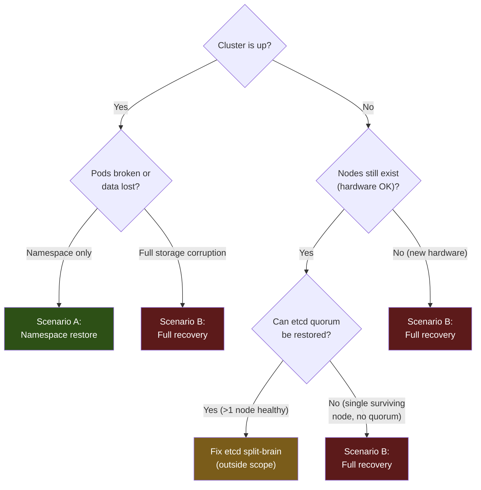

# Disaster Recovery

## Overview

This document covers recovery procedures for the Talos Kubernetes home lab. All scenarios are automated via `scripts/dr.py`. Read this document to understand the process; use `dr.py` to execute it.

Three recovery scenarios are covered:

| Scenario | When to use | Time estimate |
|---|---|---|
| **Namespace restore** | A workload is broken or data was accidentally deleted | 5–20 min |
| **Full cluster recovery** | Nodes are lost; cluster cannot be rebuilt from scratch | 30–60 min |
| **Add node** | Expanding from 1-node to 3-node, or replacing a failed node | 15–30 min |

---

## Prerequisites

Before running any recovery, ensure you have the following items **offline** (never stored on the cluster or in git):

- [ ] **SOPS age private key** (`sops.age.key`) — decrypts all Git secrets
- [ ] ~~**talos-backup age private key** (`talos-backup.age.key`)~~ — decrypted etcd
      snapshots. No longer required: no snapshots exist. See Scenario B.
- [ ] **secrets bundle** (generated during bootstrap: `talosconfig`, `secrets.yaml`, and/or `controlplane.yaml`) — required for full cluster recovery
- [ ] **AWS credentials** — to fetch offsite etcd snapshots from S3 (full recovery only)

Install required tools (or run `ansible-playbook ansible/bootstrap.yml` to install):

```bash
talosctl  kubectl  flux  sops  age  terraform  python3
```

---

## Decision Tree



---

## Scenario A — Namespace Restore

Restore a single namespace from the most recent Velero backup. Cluster must be running.

### Automated (recommended)

```bash
export SOPS_AGE_KEY_FILE=/path/to/sops.age.key

python3 scripts/dr.py namespace
```

The script:
1. Lists available Velero backups and lets you choose one
2. Triggers `velero restore` for the selected namespace
3. Polls until the restore is complete
4. Runs a basic readiness check on the restored pods

### Manual fallback

```bash
# List available backups
velero backup get

# Restore a specific namespace from a backup
velero restore create --from-backup <backup-name> \
  --include-namespaces <namespace> \
  --wait

# Check restore status
velero restore get
kubectl get pods -n <namespace>
```

---

## Scenario B — Full Cluster Recovery

Rebuild the cluster from scratch using an etcd snapshot. This wipes all nodes.

> **This scenario cannot currently be executed. There are no etcd snapshots to recover
> from, and there never have been.**
>
> A `talos-backup` CronJob ran every six hours for 44 days and exited 0 every time. It
> took the snapshot — the logs record a real one, 219 MB — and then never uploaded it.
> The `etcd-backups` bucket it targeted holds zero objects, confirmed with the SeaweedFS
> admin credential, and the AWS `homelab-etcd-backups-offsite` bucket that phases 3–5
> below read from has no mechanism writing to it at all. The CronJob was removed on
> 2026-08-25 rather than left reporting success.
>
> The steps below are kept because the *procedure* is correct and the only missing
> ingredient is the snapshot. If etcd backups are reinstated, this works again as
> written. Until then, treat phases 3–5 as unavailable.
>
> **What recovery does exist.** Everything except cluster identity is covered by
> [ADR-005](adr/0005-two-stage-backup-relay.md): Longhorn volume backups and database
> dumps, relayed to an immutable off-site vault and verified nightly. A rebuild without
> an etcd snapshot means re-provisioning Talos from `secrets.yaml`, letting Flux
> reconstruct every cluster resource from Git, and restoring data from those backups.
> What is lost is runtime-only state that Git does not describe.

### Pre-flight checklist

- [ ] Offline SOPS age private key (`sops.age.key`)
- [ ] ~~Offline talos-backup age private key (`talos-backup.age.key`)~~ — see the note
      above; phases 3–5 cannot run
- [ ] `secrets.yaml` (Talos secrets bundle generated at bootstrap)
- [ ] AWS credentials with read access to the etcd-backups S3 bucket
- [ ] Node IP addresses (or DHCP-assigned addresses visible on network)

### Automated (recommended)

```bash
export SOPS_AGE_KEY_FILE=/path/to/sops.age.key
export AWS_ACCESS_KEY_ID=<key>
export AWS_SECRET_ACCESS_KEY=<secret>
export AWS_REGION=<region>

# For 3-node:
export NODE1_IP=192.168.1.10
export NODE2_IP=192.168.1.11
export NODE3_IP=192.168.1.12
export VIP=192.168.1.100

# For 1-node:
export NODE_IP=192.168.1.10
export PRIMARY_DISK=/dev/sda
export BACKUP_DISK=/dev/sdb

python3 scripts/dr.py full
```

The script executes 9 phases:

| Phase | Action |
|---|---|
| 1 | Generate Talos machine configs from original `secrets.yaml` |
| 2 | Apply machine configs to nodes (wipes disks — confirmed interactively) |
| 3 | Fetch latest etcd snapshot from AWS S3 |
| 4 | Decrypt snapshot with talos-backup age key |
| 5 | Bootstrap etcd recovery with `talosctl bootstrap --recover-from` |
| 6 | Retrieve kubeconfig and wait for API server |
| 7 | Re-bootstrap Flux (re-applies all cluster resources from Git) |
| 8 | Re-create SeaweedFS buckets (idempotent) |
| 9 | Restore Velero backups (latest schedule snapshot) |

### Manual fallback (phase-by-phase)

**Phase 1: Regenerate Talos configs**

```bash
talosctl gen config homelab https://${VIP}:6443 \
  --with-secrets secrets.yaml \
  --output .talos/ \
  --force
```

**Phase 2: Apply configs and wipe nodes**

```bash
# WARNING: This wipes all data on the node.
talosctl apply-config --insecure --nodes ${NODE1_IP} --file .talos/controlplane.yaml
talosctl apply-config --insecure --nodes ${NODE2_IP} --file .talos/controlplane.yaml
talosctl apply-config --insecure --nodes ${NODE3_IP} --file .talos/controlplane.yaml
```

**Phase 3–4: Fetch and decrypt etcd snapshot**

```bash
# List available snapshots (newest first)
aws s3 ls s3://<cluster>-etcd-backups-offsite/ --recursive | sort -r | head -5

# Download the latest snapshot
aws s3 cp s3://<cluster>-etcd-backups-offsite/<latest-snapshot>.age /tmp/etcd.age

# Decrypt
AGE_SECRET_KEY=$(cat /path/to/talos-backup.age.key) \
  age --decrypt -i /path/to/talos-backup.age.key /tmp/etcd.age > /tmp/etcd.snapshot
```

**Phase 5: Bootstrap etcd recovery**

```bash
talosctl bootstrap \
  --talosconfig .talos/talosconfig \
  --nodes ${NODE1_IP} \
  --recover-from /tmp/etcd.snapshot
```

Wait for the cluster to come up (allow 2–5 minutes):

```bash
talosctl health --talosconfig .talos/talosconfig --nodes ${NODE1_IP}
```

**Phase 6: Retrieve kubeconfig**

```bash
talosctl kubeconfig --talosconfig .talos/talosconfig --nodes ${NODE1_IP} ~/.kube/config
kubectl get nodes
```

**Phase 7: Re-bootstrap Flux**

```bash
flux bootstrap github \
  --owner=${GITHUB_OWNER} \
  --repository=${GITHUB_REPO} \
  --path=cluster/overlays/3-node \
  --personal
```

Wait for Flux to reconcile all HelmReleases (allow 10–15 minutes):

```bash
kubectl get helmreleases -A
kubectl get kustomizations -A
```

**Phase 8: Re-create SeaweedFS buckets**

The `seaweedfs-bucket-init` Job runs automatically via Flux. If it needs to be re-triggered:

```bash
kubectl delete job seaweedfs-bucket-init -n seaweedfs
# Flux re-creates it on the next reconciliation
flux reconcile kustomization flux-system
```

**Phase 9: Velero restore**

```bash
# List available backups
velero backup get

# Restore all namespaces from the latest scheduled backup
velero restore create --from-backup <latest-backup> --wait
```

---

## Scenario C — Add Node

Add a new node to an existing 3-node cluster, or replace a failed node.

### Automated (recommended)

```bash
export SOPS_AGE_KEY_FILE=/path/to/sops.age.key
export NEW_NODE_IP=192.168.1.13

python3 scripts/dr.py add-node
```

The script:
1. Generates a machine config for the new node using the original `secrets.yaml`
2. Applies the config (`--insecure` — no bootstrap flag)
3. Waits for the new node to join etcd and the API server
4. Verifies etcd membership count
5. Runs `volume.balance` to redistribute SeaweedFS data

### Manual fallback

```bash
# Generate config for the new node (same secrets — NO new bootstrap)
talosctl gen config homelab https://${VIP}:6443 \
  --with-secrets secrets.yaml \
  --output .talos/ \
  --force

# Apply to new node only — DO NOT run 'talosctl bootstrap'
talosctl apply-config --insecure --nodes ${NEW_NODE_IP} --file .talos/controlplane.yaml

# Wait for it to join
talosctl health --talosconfig .talos/talosconfig --nodes ${VIP}

# Verify etcd membership
talosctl etcd members --talosconfig .talos/talosconfig --nodes ${NODE1_IP}

# Rebalance SeaweedFS volumes
kubectl exec -n seaweedfs seaweedfs-master-0 -- weed shell <<'EOF'
volume.balance -force
EOF
```

---

## Post-Recovery Verification Checklist

After any recovery scenario, verify the following:

```bash
# Cluster health
kubectl get nodes
talosctl health --talosconfig .talos/talosconfig

# Flux reconciliation
kubectl get kustomizations -A
kubectl get helmreleases -A

# Storage
kubectl get pods -n seaweedfs
velero backup-location get
velero backup get | head -5

# Monitoring
kubectl get pods -n monitoring
kubectl get pods -n grafana

# Network policies (Cilium)
kubectl get ciliumclusterwidenetworkpolicies

# Certificates
kubectl get certificates -A

# Scheduled backups
kubectl get cronjobs -n talos-backup
velero schedule get
```

Expected healthy state:
- All nodes `Ready`
- All HelmReleases `Ready: True`
- Velero backup-location shows `Available`
- talos-backup CronJob active

---

## Timeline Estimates

| Scenario | Minimum | Expected | Maximum |
|---|---|---|---|
| Namespace restore | 5 min | 10 min | 20 min |
| Full cluster recovery | 30 min | 45 min | 90 min |
| Add node | 10 min | 20 min | 30 min |

Full recovery time depends heavily on Flux reconciliation time (HelmRelease downloads) and Velero restore size.

---

## Key File Locations

| Item | Location |
|---|---|
| DR automation script | `scripts/dr.py` |
| Bootstrap scripts | `scripts/bootstrap-1node.sh`, `scripts/bootstrap-3node.sh` |
| Cluster overlays | `cluster/overlays/1-node/`, `cluster/overlays/3-node/` |
| SOPS config | `.sops.yaml` |
| Terraform (AWS) | `terraform/` |
| AWS provisioning | `scripts/setup-aws.sh` |
| Secret rotation | `scripts/rotate-secrets.py` |
