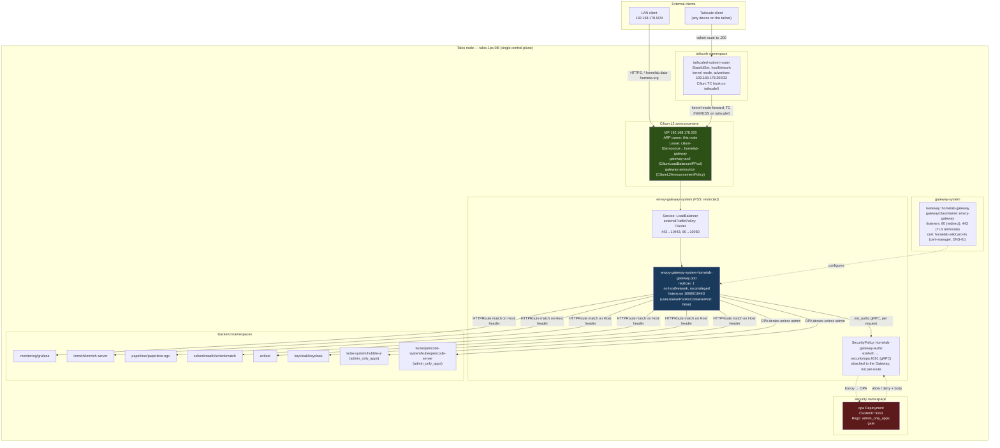
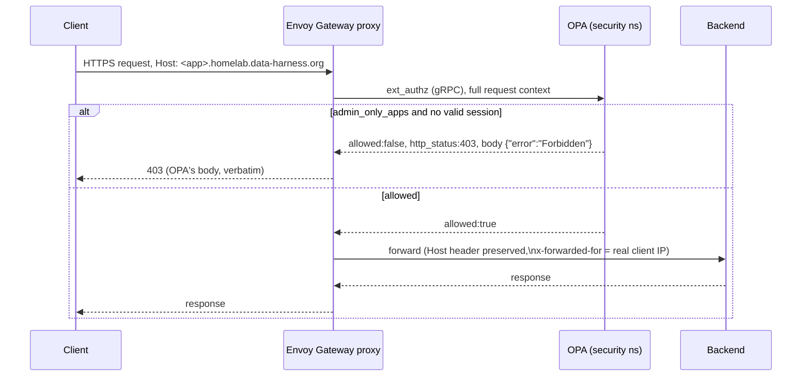
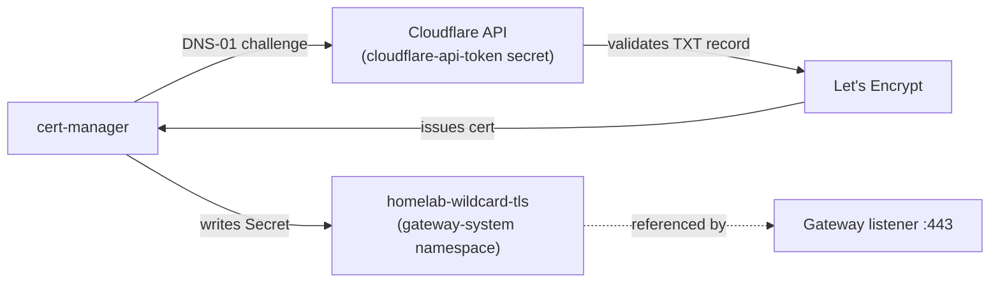

# Network architecture

Live topology of the homelab cluster's ingress, authorization, and East-West traffic
paths, as of the Envoy Gateway cutover (2026-08-16, [ADR-001](adr/0001-decoupling-l4-l7-routing-cilium-envoy-gateway.md),
[#126](https://github.com/bibAtWork/Edge_GitOps/pull/126)). Diagrams are generated from
the manifests in `cluster/base/infrastructure/` and cross-checked against the running
cluster — not hand-drawn intent.

This is a living document. If a diagram and the manifests disagree, the manifests are
correct — open a PR to fix the diagram.

## 1. Ingress topology — how a request reaches a backend



The VIP's survival across the Gateway-implementation swap, and the ordering constraint
that made the cutover safe rather than lucky, are both operational mechanics rather than
architecture — see `Agent.md`, "Envoy Gateway cutover (2026-08-16) — two mechanisms that
made it safe, not obvious from the manifests", for the full explanation, the live
experiment that proved it, and the checklist for not breaking it in a future change.

**Why the ingress CiliumNetworkPolicy uses 10080/10443, not 80/443.** Envoy Gateway
defaults to `useListenerPortAsContainerPort: false`: a listener below 1024 is served on
`port + 10000` inside the container, specifically so the proxy never needs
`CAP_NET_BIND_SERVICE`. A LoadBalancer VIP DNATs straight to the pod, so external traffic
arrives on the container port — a policy written for 80/443 silently drops every
connection with `policy-verdict:none INGRESS DENIED`, indistinguishable from a datapath
bug until you read the port in the Hubble verdict. This was the actual two-day blocker
behind the original (and wrong) `cilium#44630` / kube-proxy theories — see
`docs/backlog.md`.

## 2. Authorization decision path



OPA is consulted on **every** request through the Gateway, not just the two
`admin_only_apps` (Hubble UI, KubeOpenCode) — Grafana, Paperless, and Immich also pass
through `ext_authz` and are allowed by policy, relying on their own native OIDC clients
for the actual login. OPA's decision log is the ground truth for "is this actually
enforced" — confirmed live 2026-08-16 by reading `"result":{"allowed":...}` per app,
not by HTTP status code alone, since a generic Cilium network block and an OPA JSON
`403` are otherwise indistinguishable from `curl` output.

**Known gap, not yet closed:** neither Hubble UI nor KubeOpenCode has real per-user OIDC.
`admin_only_apps` is a coarse Rego allow/deny, not identity-aware. An `oauth2-proxy`
attempt in front of Hubble UI (2026-08-12) hit an unrelated Cilium policy-realization bug
and was abandoned; a `SecurityPolicy.oidc` block against Keycloak is the intended fix and
is not yet implemented.

## 3. East-West microsegmentation model

```mermaid
flowchart LR
    subgraph default["Cluster-wide default (CiliumClusterwideNetworkPolicy)"]
        direction TB
        deny_ing["default-deny-ingress\nallow only fromEntities: [host]\n(excludes reserved:ingress —\nthe Gateway has its own rule)"]
        deny_eg["default-deny-egress\nallow only toEntities: [host, kube-apiserver]"]
    end

    subgraph pattern["Per-namespace pattern, repeated ~25 times"]
        direction TB
        intra["allow-intra-namespace-egress\n(required in every namespace,\nor pods can't reach same-namespace peers)"]
        specific["Targeted allow rules\ne.g. allow-paperless-to-keycloak-egress,\nallow-opa-ingress, allow-gateway-ingress"]
    end

    subgraph example["Example: keycloak namespace"]
        direction TB
        kc["keycloak pod"]
        kc_rules["allow-gateway-ingress (from Envoy Gateway)\nallow-opa-ingress (OPA needs Keycloak for token introspection)\nallow-paperless-ingress (paperless OIDC callback)\nallow-intra-namespace-egress/ingress"]
    end

    deny_ing -.->|baseline| pattern
    deny_eg -.->|baseline| pattern
    pattern -.-> example

    style deny_ing fill:#5c1a1a,color:#fff
    style deny_eg fill:#5c1a1a,color:#fff
```

Default-deny is cluster-wide; every namespace opts back in explicitly. The
`default-deny-ingress` rule is scoped with `reserved.ingress: DoesNotExist` specifically
so it does not fight the Gateway's own ingress rule — an easy accidental overlap if
copied without that exclusion.

**A subtlety worth remembering when testing Gateway reachability:** an in-cluster test
pod making a cross-namespace request to the Gateway's VIP is evaluated by Cilium against
the **client pod's own egress** reaching the real resolved backend — not against the
Gateway itself ([cilium/cilium#47617](https://github.com/cilium/cilium/issues/47617),
maintainer-confirmed, not a bug). This cluster's `allow-intra-namespace-egress`-only
model means an in-cluster pod calling a different namespace's app through the Gateway
will get a false-negative 403 regardless of how the Gateway is configured. **Always test
Gateway reachability from a genuinely external client** (LAN or Tailscale) — verified
2026-08-14.

## 4. Certificate issuance (DNS-01, no inbound HTTP needed)



DNS-01 means the cluster never needs inbound port 80 reachable from the public internet
for cert issuance — consistent with the "zero public exposure" posture the two draft
ADRs (`ADR-002` "Dark Cluster", `ADR-005` "Dual-Path Hybrid") both assumed, without
either of them needing to be adopted. `external-dns` publishes the LAN-only
`192.168.178.200` under public DNS; those records only resolve for clients who can
actually route to that RFC1918 address (LAN or the Tailscale subnet route) — publicly
resolvable, not publicly reachable.

## 5. What this replaced

Until 2026-08-16, `homelab-gateway` ran on Cilium's own embedded `GatewayClass`
(`gatewayClassName: cilium`), and the OPA gate used the Gateway API `ExternalAuth`
HTTPRoute filter (GEP-1494, Experimental channel) per-route instead of the
`SecurityPolicy` shown above. Two findings forced the change in the same commit rather
than as separate steps:

- Envoy Gateway does not implement the `ExternalAuth` filter at all —
  `Accepted=False (UnsupportedValue): unsupported filter type ExternalAuth` — so a route
  still carrying it would stop resolving the instant the `GatewayClass` flipped.
- Cilium's own Gateway never needed an ingress `CiliumNetworkPolicy` for its VIP, because
  its backend is a TPROXY handoff to `127.0.0.1:13410` (the node-local embedded Envoy
  socket), not a pod IP — a fundamentally different datapath from Envoy Gateway's, where
  the VIP DNATs directly to a pod.

Full investigation trail, including two earlier (wrong) root-cause theories for the
LoadBalancer VIP failure that blocked this cutover for two days, is in
[`docs/backlog.md`](backlog.md).
