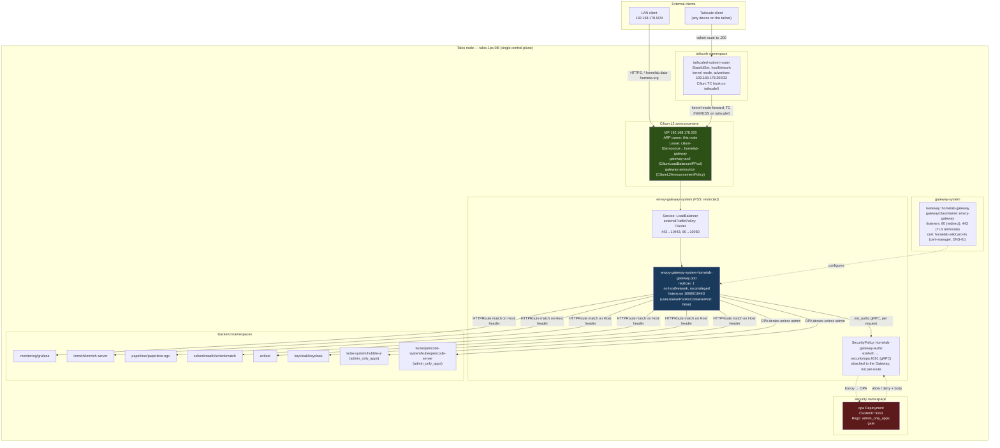
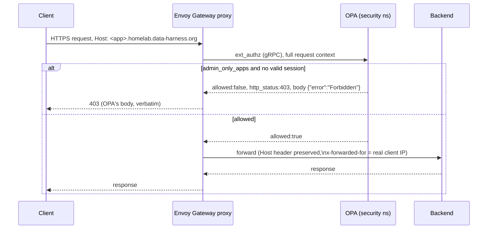
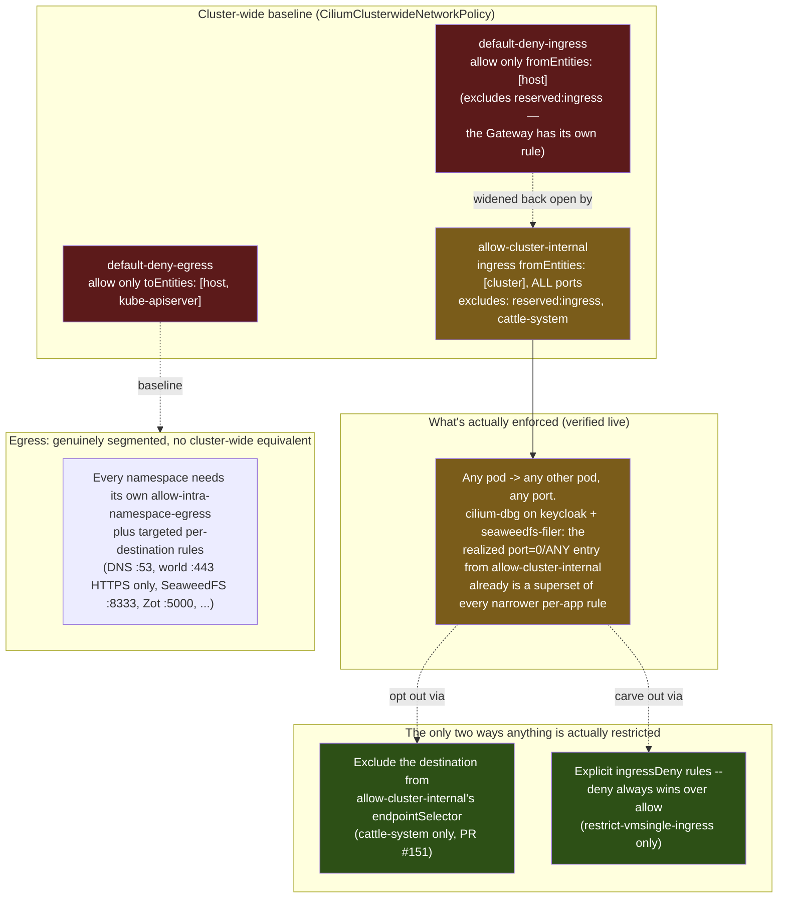
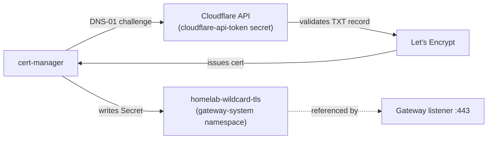

# Network architecture

Live topology of the homelab cluster's ingress, authorization, and East-West traffic
paths, as of the Envoy Gateway cutover (2026-08-16, [ADR-001](adr/0001-decoupling-l4-l7-routing-cilium-envoy-gateway.md),
[#126](https://github.com/bibAtWork/Edge_GitOps/pull/126)). Diagrams are generated from
the manifests in `cluster/base/infrastructure/` and cross-checked against the running
cluster — not hand-drawn intent.

This is a living document. If a diagram and the manifests disagree, the manifests are
correct — open a PR to fix the diagram.

## 1. Ingress topology — how a request reaches a backend

The VIP's survival across the Gateway-implementation swap, and the ordering constraint
that made the cutover safe rather than lucky, are both operational mechanics rather than
architecture — see `Agent.md`, "Envoy Gateway cutover (2026-08-16) — two mechanisms that
made it safe, not obvious from the manifests", for the full explanation, the live
experiment that proved it, and the checklist for not breaking it in a future change.

**Why the ingress CiliumNetworkPolicy uses 10080/10443, not 80/443.** Envoy Gateway
defaults to `useListenerPortAsContainerPort: false`: a listener below 1024 is served on
`port + 10000` inside the container, specifically so the proxy never needs
`CAP_NET_BIND_SERVICE`. A LoadBalancer VIP DNATs straight to the pod, so external traffic
arrives on the container port — a policy written for 80/443 silently drops every
connection with `policy-verdict:none INGRESS DENIED`, indistinguishable from a datapath
bug until you read the port in the Hubble verdict. This was the actual two-day blocker
behind the original (and wrong) `cilium#44630` / kube-proxy theories — see
`docs/backlog.md`.

## 2. Authorization decision path

OPA is consulted on **every** request through the Gateway, not just the two
`admin_only_apps` (Hubble UI, KubeOpenCode) — Grafana, Paperless, and Immich also pass
through `ext_authz` and are allowed by policy, relying on their own native OIDC clients
for the actual login. OPA's decision log is the ground truth for "is this actually
enforced" — confirmed live 2026-08-16 by reading `"result":{"allowed":...}` per app,
not by HTTP status code alone, since a generic Cilium network block and an OPA JSON
`403` are otherwise indistinguishable from `curl` output.

**Known gap, not yet closed:** neither Hubble UI nor KubeOpenCode has real per-user OIDC.
`admin_only_apps` is a coarse Rego allow/deny, not identity-aware. An `oauth2-proxy`
attempt in front of Hubble UI (2026-08-12) hit an unrelated Cilium policy-realization bug
and was abandoned; a `SecurityPolicy.oidc` block against Keycloak is the intended fix and
is not yet implemented.

## 3. East-West microsegmentation model — and why it's mostly not one

**The ingress side is not actually segmented.** `default-deny-ingress` is the cluster-wide
baseline, but `allow-cluster-internal` immediately widens it back to "any pod may reach any
other pod, on any port" for every namespace except `reserved:ingress` (the Gateway proxy,
which has its own dedicated policy) and `cattle-system` (excluded 2026-08-17,
[#151](https://github.com/bibAtWork/Edge_GitOps/pull/151), the one namespace whose sole
workload holds a cluster-admin `ClusterRoleBinding`).

Because Cilium/Kubernetes network policies are additive — a pod's effective ingress is the
union of every applicable allow rule, and the broadest one wins — the many narrow, per-app
ingress rules elsewhere in this repo (`allow-opa-ingress`, `allow-paperless-ingress`,
`allow-gateway-ingress`, `allow-envoy-gateway-ingress` in `26-keycloak/cilium-policy.yaml`;
`allow-seaweedfs-internal`'s port-8333 restriction; similar patterns in `16-immich`,
`17-paperless-ngx`, `22-schenkmatch`, `24-opa`, `27-kubeopencode`) provide **no actual
enforcement** today. Verified live via `cilium-dbg endpoint get <id> -o json`, reading
`status.policy.realized.l4.ingress`:

- **Keycloak** (endpoint 896): the realized L4 policy has a `port=0, protocol=ANY` entry
  whose `derived-from-rules` includes `allow-cluster-internal` — that entry alone already
  permits every port from every cluster identity. The narrower `port=8080, protocol=TCP`
  entry (derived from `allow-opa-ingress`/`allow-paperless-ingress`/
  `allow-envoy-gateway-ingress`) is a strict subset of the first and adds nothing.
- **SeaweedFS filer** (endpoint 76, serves the S3 API on :8333): identical pattern —
  `port=0/ANY` from `allow-cluster-internal` already covers the `port=8333/TCP` entry
  `allow-seaweedfs-internal` was written to restrict.

**This directly affects the SeaweedFS auth model documented in `CLAUDE.md`**, which states
the Cilium policy restricting port 8333 "is the primary auth boundary inside the cluster"
for S3 access, with the shared admin credential as a second, defence-in-depth layer. As
currently deployed, that's not accurate: any pod in the cluster can already reach
SeaweedFS's S3 port, on any port, because `seaweedfs` is not excluded from
`allow-cluster-internal`. The admin credential is, in practice, the *only* real access
control on SeaweedFS S3 today. This is a real gap, not a documentation nit — flagged here
rather than fixed, since narrowing it is a deliberate policy change (either excluding
`seaweedfs` from `allow-cluster-internal` the way `cattle-system` is, or adding an
`ingressDeny` the way `restrict-vmsingle-ingress` does) that needs checking against every
legitimate caller first — the CSI driver, Velero, `talos-backup`, Zot, and Trivy all reach
it today, and some may currently depend on `allow-cluster-internal` for reachability
without an explicit rule of their own.

**The only two places anything is actually restricted beyond the cluster-wide allow:**

1. **Exclude the destination from `allow-cluster-internal`'s `endpointSelector`** — the
   only user of this pattern is `cattle-system` (PR #151). The excluded namespace falls
   back to the bare `default-deny-ingress` baseline (host only).
2. **Explicit `ingressDeny` rules**, which win over any `allow` regardless of specificity —
   the only user of this pattern in the whole repo is `restrict-vmsingle-ingress`
   (`10-network-policies/allow-monitoring.yaml`), which denies
   `node-exporter`/`kube-state-metrics`/`otel-agent` from calling VictoriaMetrics' query
   API directly while allowing Grafana/vmagent/vmalert/the operator/otel-gateway.

**Egress has no equivalent problem.** There is no cluster-wide "allow all egress" policy —
`default-deny-egress` really is the effective baseline, and every namespace opts into
exactly what it needs: `allow-intra-namespace-egress` (same-namespace only, required in
~25 namespaces or pods can't reach same-namespace peers), `allow-dns-egress` (port 53 to
CoreDNS only), `allow-internet-egress-https-only` (world, port 443 only), and narrow
per-target rules like `allow-velero-egress`/`allow-zot-egress`/`allow-talos-backup-egress`
(SeaweedFS :8333, S3 FQDNs on :443, DNS — nothing else). A pod that needs to reach
something new on the egress side genuinely needs a new policy; the same is not true on the
ingress side for anything not excluded from `allow-cluster-internal`.

The `default-deny-ingress` rule is scoped with `reserved.ingress: DoesNotExist`
specifically so it does not fight the Gateway's own ingress rule — an easy accidental
overlap if copied without that exclusion.

**A subtlety worth remembering when testing Gateway reachability:** an in-cluster test
pod making a cross-namespace request to the Gateway's VIP is evaluated by Cilium against
the **client pod's own egress** reaching the real resolved backend — not against the
Gateway itself ([cilium/cilium#47617](https://github.com/cilium/cilium/issues/47617),
maintainer-confirmed, not a bug). This cluster's `allow-intra-namespace-egress`-only
model means an in-cluster pod calling a different namespace's app through the Gateway
will get a false-negative 403 regardless of how the Gateway is configured. **Always test
Gateway reachability from a genuinely external client** (LAN or Tailscale) — verified
2026-08-14.

## 4. Certificate issuance (DNS-01, no inbound HTTP needed)

DNS-01 means the cluster never needs inbound port 80 reachable from the public internet
for cert issuance — consistent with the "zero public exposure" posture the two draft
ADRs (`ADR-002` "Dark Cluster", `ADR-005` "Dual-Path Hybrid") both assumed, without
either of them needing to be adopted. `external-dns` publishes the LAN-only
`192.168.178.200` under public DNS; those records only resolve for clients who can
actually route to that RFC1918 address (LAN or the Tailscale subnet route) — publicly
resolvable, not publicly reachable.

## 5. What this replaced

Until 2026-08-16, `homelab-gateway` ran on Cilium's own embedded `GatewayClass`
(`gatewayClassName: cilium`), and the OPA gate used the Gateway API `ExternalAuth`
HTTPRoute filter (GEP-1494, Experimental channel) per-route instead of the
`SecurityPolicy` shown above. Two findings forced the change in the same commit rather
than as separate steps:

- Envoy Gateway does not implement the `ExternalAuth` filter at all —
  `Accepted=False (UnsupportedValue): unsupported filter type ExternalAuth` — so a route
  still carrying it would stop resolving the instant the `GatewayClass` flipped.
- Cilium's own Gateway never needed an ingress `CiliumNetworkPolicy` for its VIP, because
  its backend is a TPROXY handoff to `127.0.0.1:13410` (the node-local embedded Envoy
  socket), not a pod IP — a fundamentally different datapath from Envoy Gateway's, where
  the VIP DNATs directly to a pod.

Full investigation trail, including two earlier (wrong) root-cause theories for the
LoadBalancer VIP failure that blocked this cutover for two days, is in
[`docs/backlog.md`](backlog.md).
