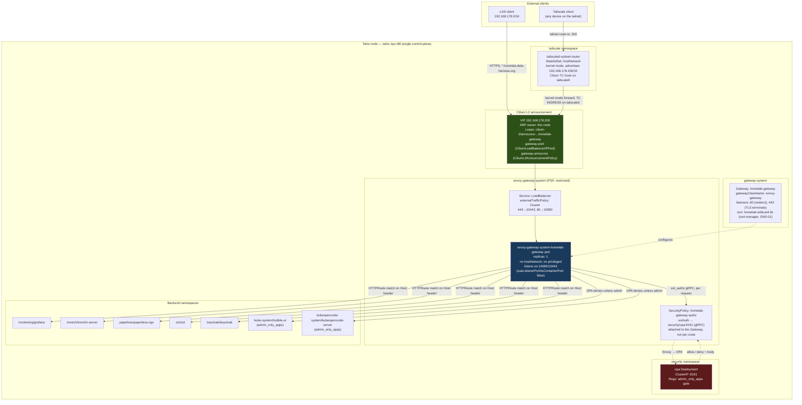
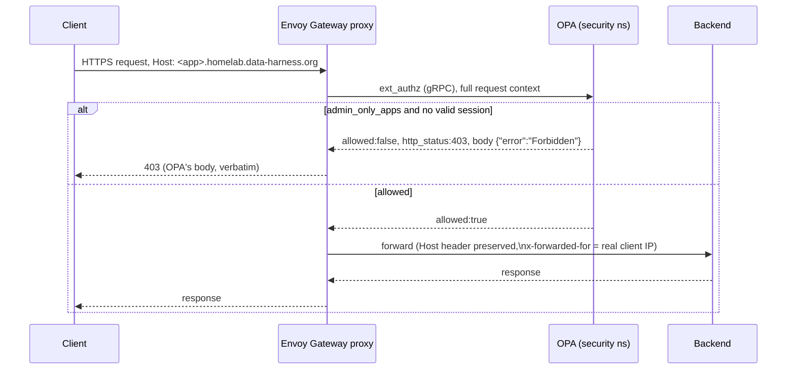
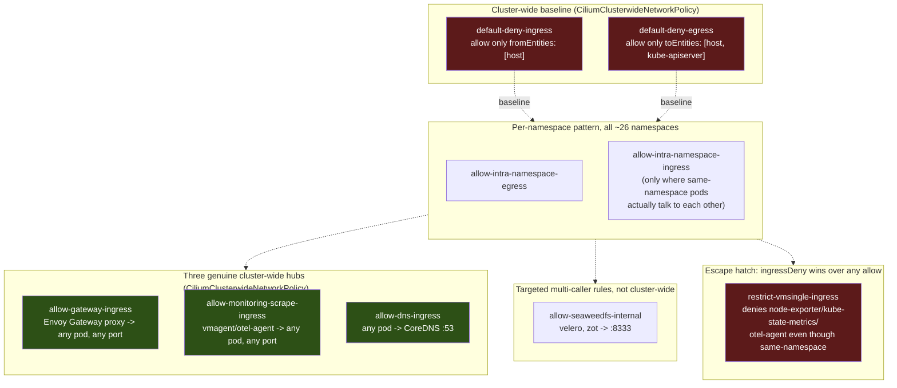
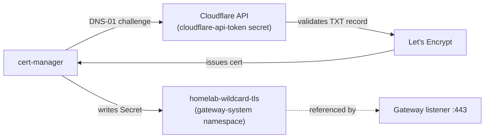

# Network architecture

Live topology of the homelab cluster's ingress, authorization, and East-West traffic
paths, as of the Envoy Gateway cutover (2026-08-16, [ADR-001](adr/0001-decoupling-l4-l7-routing-cilium-envoy-gateway.md),
[#126](https://github.com/bibAtWork/Edge_GitOps/pull/126)). Diagrams are generated from
the manifests in `cluster/base/infrastructure/` and cross-checked against the running
cluster — not hand-drawn intent.

This is a living document. If a diagram and the manifests disagree, the manifests are
correct — open a PR to fix the diagram.

## 1. Ingress topology — how a request reaches a backend

The VIP's survival across the Gateway-implementation swap, and the ordering constraint
that made the cutover safe rather than lucky, are both operational mechanics rather than
architecture — see `Agent.md`, "Envoy Gateway cutover (2026-08-16) — two mechanisms that
made it safe, not obvious from the manifests", for the full explanation, the live
experiment that proved it, and the checklist for not breaking it in a future change.

**Why the ingress CiliumNetworkPolicy uses 10080/10443, not 80/443.** Envoy Gateway
defaults to `useListenerPortAsContainerPort: false`: a listener below 1024 is served on
`port + 10000` inside the container, specifically so the proxy never needs
`CAP_NET_BIND_SERVICE`. A LoadBalancer VIP DNATs straight to the pod, so external traffic
arrives on the container port — a policy written for 80/443 silently drops every
connection with `policy-verdict:none INGRESS DENIED`, indistinguishable from a datapath
bug until you read the port in the Hubble verdict. This was the actual two-day blocker
behind the original (and wrong) `cilium#44630` / kube-proxy theories — see
`docs/backlog.md`.

**Stop re-approving the Tailscale subnet route by hand.** `tailscaled-subnet-router`
(`14-tailscale-operator/config/subnet-router-hostnetwork.yaml`) advertises
`192.168.178.200/32` and, by design, that route "must be approved once in the Tailscale
admin console (or via ACL)" — but without the ACL half, every reset of that approval state
means going back to the console manually. Set it up once instead: **Tailscale admin
console → [Access controls → Auto approvers tab](https://console.tailscale.com/admin/acls/visual/auto-approvers)**
(the visual editor; the same change can also be made directly in the ACL JSON under an
`autoApprovers.routes` key) → add `192.168.178.200/32` approved for `tag:k8s-operator`,
the tag this router already advertises (`TS_EXTRA_ARGS: --advertise-tags=tag:k8s-operator`).
`tag:k8s-operator` must already exist under `tagOwners` for this to take — it does, since
the router is already using it today; only missing if the tailnet's ACL was reset from
scratch. Once set, this is genuinely one-time — no per-namespace or per-cluster-change
follow-up needed.

## 2. Authorization decision path

OPA is consulted on **every** request through the Gateway, not just the two
`admin_only_apps` (Hubble UI, KubeOpenCode) — Grafana, Paperless, and Immich also pass
through `ext_authz` and are allowed by policy, relying on their own native OIDC clients
for the actual login. OPA's decision log is the ground truth for "is this actually
enforced" — confirmed live 2026-08-16 by reading `"result":{"allowed":...}` per app,
not by HTTP status code alone, since a generic Cilium network block and an OPA JSON
`403` are otherwise indistinguishable from `curl` output.

**Known gap, not yet closed:** neither Hubble UI nor KubeOpenCode has real per-user OIDC.
`admin_only_apps` is a coarse Rego allow/deny, not identity-aware. An `oauth2-proxy`
attempt in front of Hubble UI (2026-08-12) hit an unrelated Cilium policy-realization bug
and was abandoned; a `SecurityPolicy.oidc` block against Keycloak is the intended fix and
is not yet implemented.

## 3. East-West microsegmentation model

**Default-deny is the real, fully-enforced baseline now — no exceptions.**
`allow-cluster-internal`, the `CiliumClusterwideNetworkPolicy` that used to grant every pod
ingress from any other pod on any port, is gone (removed 2026-08-17, PR #182, after every
namespace was migrated off it in stages across
[#177](https://github.com/bibAtWork/Edge_GitOps/pull/177)–[#181](https://github.com/bibAtWork/Edge_GitOps/pull/181)).
Until that migration, the many narrow per-app ingress rules throughout this repo were
additive no-ops — Cilium/Kubernetes policy is additive, and the broadest applicable rule
wins, so `allow-cluster-internal`'s `port=0/ANY` grant silently swallowed everything
narrower underneath it. Confirmed *fixed*, not just removed: `cilium-dbg endpoint get`
on Keycloak and the SeaweedFS filer, the same two endpoints originally used to prove the
old model was broken, now show `allowed-ingress-identities` limited to `host` plus the
specific hub/per-caller identities that actually apply — no more `cluster`-wide entry.

Every namespace now gets ingress exactly one of these ways:

1. **Same-namespace only** (`allow-intra-namespace-ingress`, ~10 namespaces where
   pods genuinely talk to each other — Keycloak/Postgres, Immich's
   server/ML/valkey/postgres, the VictoriaMetrics stack, Flux's controller fan-in to
   `notification-controller`, Falco's DaemonSet-to-`k8s-metacollector` link, etc.).
   Most namespaces don't need even this — a namespace with one workload and no peers gets
   nothing beyond the bare baseline (host only), same as `cattle-system` since
   [#151](https://github.com/bibAtWork/Edge_GitOps/pull/151).
2. **One of three cluster-wide hubs**, the only things that genuinely need to reach into
   every namespace: `allow-gateway-ingress` (the Envoy Gateway proxy, so it can forward
   any HTTPRoute-matched request), `allow-monitoring-scrape-ingress` (vmagent/otel-agent,
   so metrics scraping doesn't need a bespoke rule per target), `allow-dns-ingress`
   (CoreDNS — found missing entirely during the migration; see below).
3. **A targeted multi-caller rule**, for the rare case of "several specific namespaces,
   not everyone" — `allow-seaweedfs-internal`'s caller list (`velero`, `zot`) is the
   only current example. This is what closes the gap `CLAUDE.md`'s
   SeaweedFS architecture note always assumed existed: the Cilium policy restricting
   `:8333` genuinely is the primary auth boundary now, with the shared admin credential
   as real defence-in-depth rather than the only thing actually enforcing anything.
4. **`ingressDeny`**, which wins over any `allow` regardless of specificity —
   `restrict-vmsingle-ingress` is still the only user of this pattern, denying
   `node-exporter`/`kube-state-metrics`/`otel-agent` from querying VictoriaMetrics
   directly even though they're in the same namespace as everything the allowlist covers.

**Three real gaps surfaced only by actually doing the narrowing, not by the design work
beforehand** — each is a reminder that a static audit (however careful) and a live
Hubble-verified rollout catch different classes of mistake:

- **CoreDNS had never had an ingress rule of its own.** Every namespace's DNS *egress*
  rule only covers the caller's side; nothing on CoreDNS's side ever explicitly allowed
  those queries in — it had been carried entirely by `allow-cluster-internal` since day
  one. Excluding `kube-system` without catching this first would have broken DNS
  resolution cluster-wide. Caught during pre-application review, not after.
- **Zot had no ingress rule for Trivy**, and **Falco's DaemonSet pods talk to an implicit
  `k8s-metacollector` component** (`collectors.kubernetes.enabled: true`) neither visible
  in a values-file read nor obviously named. Both caught live via Hubble within minutes of
  applying, both fixed before merging.
- **SeaweedFS's own setup Jobs** (`seaweedfs-bucket-init`, `seaweedfs-collection-routing`)
  carry only `batch.kubernetes.io/job-name`-style labels, not
  `app.kubernetes.io/name=seaweedfs` — the label-scoped same-namespace rule never covered
  them. Surfaced only after `allow-cluster-internal` was deleted *entirely* (the last of
  26 exclusions), since until then it was still silently covering this one remaining gap.

**Egress remains what it always was — genuinely segmented, no cluster-wide equivalent.**
There has never been a cluster-wide "allow all egress" policy: `default-deny-egress` is the
real baseline on both sides now. Every namespace opts into exactly what it needs:
`allow-intra-namespace-egress`, `allow-dns-egress` (port 53 to CoreDNS only),
`allow-internet-egress-https-only` (world, port 443 only), and narrow per-target rules like
`allow-velero-egress`/`allow-zot-egress` (SeaweedFS `:8333`, S3
FQDNs on `:443`, DNS — nothing else).

The `default-deny-ingress` rule is scoped with `reserved.ingress: DoesNotExist`
specifically so it does not fight the Gateway's own ingress rule — an easy accidental
overlap if copied without that exclusion.

**A subtlety worth remembering when testing Gateway reachability:** an in-cluster test
pod making a cross-namespace request to the Gateway's VIP is evaluated by Cilium against
the **client pod's own egress** reaching the real resolved backend — not against the
Gateway itself ([cilium/cilium#47617](https://github.com/cilium/cilium/issues/47617),
maintainer-confirmed, not a bug). This cluster's `allow-intra-namespace-egress`-only
model means an in-cluster pod calling a different namespace's app through the Gateway
will get a false-negative 403 regardless of how the Gateway is configured. **Always test
Gateway reachability from a genuinely external client** (LAN or Tailscale) — verified
2026-08-14.

## 4. Certificate issuance (DNS-01, no inbound HTTP needed)

DNS-01 means the cluster never needs inbound port 80 reachable from the public internet
for cert issuance — consistent with the "zero public exposure" posture the two draft
ADRs (`ADR-002` "Dark Cluster", `ADR-005` "Dual-Path Hybrid") both assumed, without
either of them needing to be adopted. `external-dns` publishes the LAN-only
`192.168.178.200` under public DNS; those records only resolve for clients who can
actually route to that RFC1918 address (LAN or the Tailscale subnet route) — publicly
resolvable, not publicly reachable.

## 5. What this replaced

Until 2026-08-16, `homelab-gateway` ran on Cilium's own embedded `GatewayClass`
(`gatewayClassName: cilium`), and the OPA gate used the Gateway API `ExternalAuth`
HTTPRoute filter (GEP-1494, Experimental channel) per-route instead of the
`SecurityPolicy` shown above. Two findings forced the change in the same commit rather
than as separate steps:

- Envoy Gateway does not implement the `ExternalAuth` filter at all —
  `Accepted=False (UnsupportedValue): unsupported filter type ExternalAuth` — so a route
  still carrying it would stop resolving the instant the `GatewayClass` flipped.
- Cilium's own Gateway never needed an ingress `CiliumNetworkPolicy` for its VIP, because
  its backend is a TPROXY handoff to `127.0.0.1:13410` (the node-local embedded Envoy
  socket), not a pod IP — a fundamentally different datapath from Envoy Gateway's, where
  the VIP DNATs directly to a pod.

Full investigation trail, including two earlier (wrong) root-cause theories for the
LoadBalancer VIP failure that blocked this cutover for two days, is in
[`docs/backlog.md`](backlog.md).
