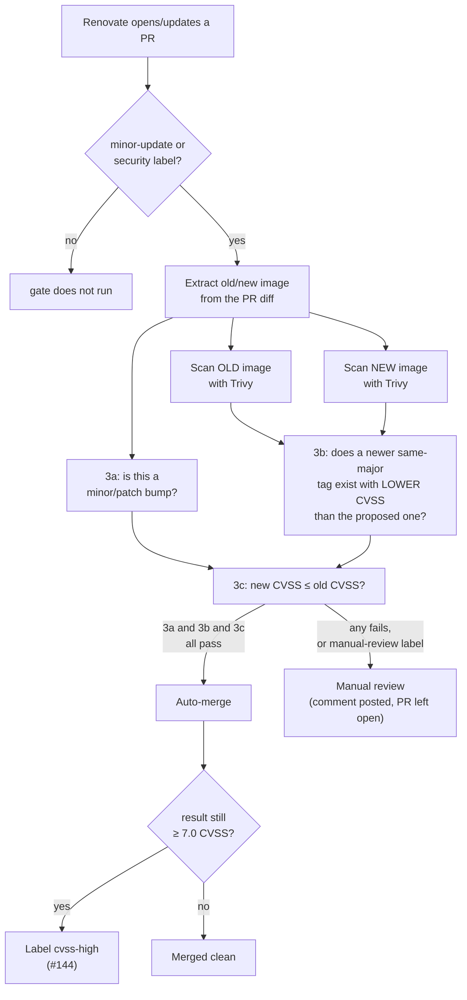
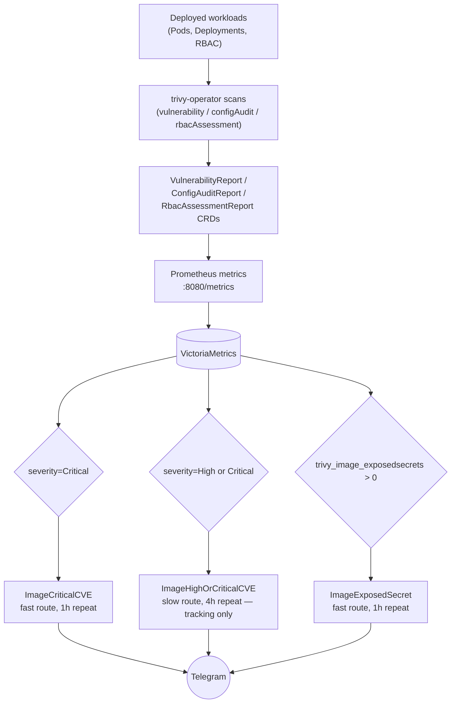
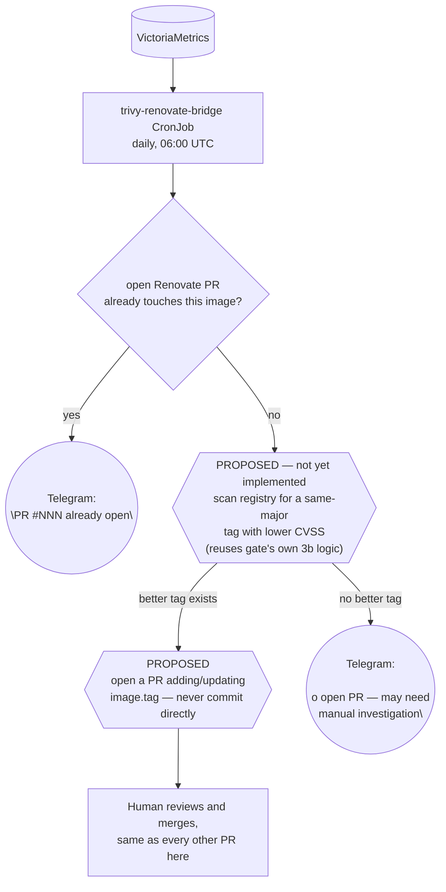

# Renovate + Trivy flow

How dependency updates and vulnerability findings move through this repo, from Renovate
opening a PR to a fix actually landing in `ops/talos_linux`. Diagrams are generated from
the manifests in `.github/workflows/`, `cluster/base/infrastructure/13-trivy-operator/`,
`cluster/base/infrastructure/30-trivy-renovate-bridge/`, and
`cluster/base/infrastructure/04-grafana/helmrelease.yaml` — not hand-drawn intent.

This is a living document. If a diagram and the manifests disagree, the manifests are
correct — open a PR to fix the diagram.

Two independent pipelines exist, and most of the design complexity here is in how they
connect (or fail to). **PR-time** (`section 1`) only sees images already showing up as a
diff in a Renovate PR. **Continuous** (`section 2`) only sees images already deployed in
the cluster. Neither one alone can catch "an already-deployed image just got a new
Critical CVE and nobody proposed a fix" — that gap, and the bridge closing it, is
`section 3`.

## 1. PR-time: the Trivy CVE gate

`.github/workflows/trivy-automerge.yml`, triggered on every Renovate PR carrying a
`minor-update` or `security` label.

**Rules, precisely:**

- **3a** — minor/patch version bump (never auto-merges a major)
- **3b** — no newer same-major tag exists with a strictly lower CVSS than the one proposed
  (if one does, the PR waits rather than merging something already known to be worse than
  what's about to exist)
- **3c** — the proposed update doesn't *worsen* CVE posture (`new_cvss <= old_cvss`) — not
  "CVE posture is acceptable." An image can auto-merge while stuck at HIGH/CRITICAL
  indefinitely if every successive bump is merely no-worse than the last. `cvss-high`
  (finding, 2026-08-16 / fix, #144) exists specifically so that stays visible instead of
  disappearing into the merged-PR list.

Chart-only updates (no image diff detected) skip the scan entirely and auto-merge if
labeled `minor-update`. PRs labeled `manual-review` (bootstrap-critical components) never
auto-merge regardless of CVE posture.

## 2. Continuous: trivy-operator + alerting

Nothing here depends on a PR existing. trivy-operator scans whatever is actually running,
on its own schedule, independent of how it got there.

All three rules live in `04-grafana/helmrelease.yaml` (`Trivy CVE Alerts` group). They
match on the `severity` label directly (`Critical` / `High`), not a CVSS score regex —
Trivy's own severity classification is already CVSS-derived, and a regex has an
off-by-one boundary risk a label match doesn't.

**Known trap, hit twice already**: Grafana's file-based alert provisioning only
creates/updates rules present in `rules.yaml` — it never deletes one that's been removed.
Retiring a rule requires an explicit entry in `deleteRules.yaml`
(`cluster/overlays/1-node/patches/grafana-telegram.yaml`), or the old rule keeps running
forever with nothing pointing at it from git.

**Known trap, the metric itself**: `trivy_image_exposedsecrets` and
`trivy_vulnerability_id` are point-in-time series that persist until they naturally age
out of VictoriaMetrics — regenerating the underlying report (e.g. by deleting the CRD to
force a rescan) doesn't retroactively clear the *old* series immediately. A dashboard or
alert can show a finding for a few minutes after it's actually been fixed. Cross-check
against `kubectl get vulnerabilityreport` before treating a reading as current.

## 3. The gap: already-deployed images have no path back to a fix

Trivy's own review finding (2026-08-17): the two pipelines above don't talk to each
other. An image already running in the cluster that develops a new Critical CVE has
no automated route to "someone should bump this" — it just sits in a report (now, a
`ImageCriticalCVE` page) with no indication of whether a fix is one merge away or
genuinely blocked upstream.

**Live today** (`30-trivy-renovate-bridge/cronjob.yaml`): the discovery half — query
VictoriaMetrics for images with an active Critical CVE, check this repo's open PRs
(public repo, unauthenticated GitHub API, no credential needed), post a Telegram summary.
Reuses `monitoring/telegram-credentials` (already generic, not Grafana-specific) rather
than provisioning anything new. Verified live 2026-08-17: a forced run found 10 images
with active Critical CVEs, all correctly reported as having no open Renovate PR yet.

**Proposed, not yet implemented**: the registry-scan and PR-creation steps. Blocked on an
architecture decision, not effort — see the note below.

**Why this step is mostly a no-op by design, not a bug**: Renovate can only track an
image tag it can see as an explicit string in this repo's own YAML. For images with an
explicit `image.tag` override already present (the Trivy scan job image, KubeOpenCode's
agent images, mcp-server), Renovate already handles this and a Renovate PR already exists
whenever one's possible — meaning branch `Y -- yes` already covers them; this step never
even runs for them. It only ever finds something for charts like Grafana or Velero, where
the deployed tag comes from the chart's own bundled default and Renovate has nothing to
point at — confirmed live 2026-08-17 for exactly those two.

### Open question: where does the write-capable half run?

Opening a PR needs push + PR-create permission on this repo. Two credential paths, not
yet decided:

1. **In-cluster**: give the existing CronJob a narrowly-scoped GitHub PAT
   (`contents:write` + `pull-requests:write`, this repo only) as a new SOPS-encrypted
   secret. Simplest control flow — one job does discovery, scanning, and the PR in one
   place — but it's genuinely new credential surface inside a cluster whose git repo *is*
   the deploy target: write access to this repo is close to write access to the cluster,
   since Flux applies whatever lands in `ops/talos_linux`.
2. **GitHub Actions**: move the registry-scan + PR-creation steps into a new scheduled
   workflow that reuses the CVE gate's own toolchain (Trivy, crane) and its ambient
   `GITHUB_TOKEN` — no new credential at all on the GitHub side. The catch: GitHub-hosted
   runners can't reach the in-cluster VictoriaMetrics endpoint (no public ingress, by
   design). Would need the runner joining the Tailscale tailnet for the query step
   (`tailscale/github-action`, already-deployed Tailscale operator) — a real, if narrower
   and more conventional, new credential (a scoped Tailscale auth key) and a new class of
   thing on the tailnet (an ephemeral GitHub-hosted device, each run).

Neither path is provisionable without the user's action (generating a token/key through
a UI this session has no access to) — this is the reason section 3's write half is
diagrammed but not built yet.
