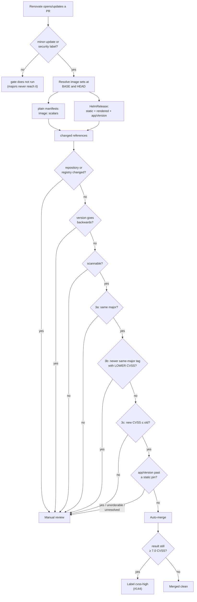
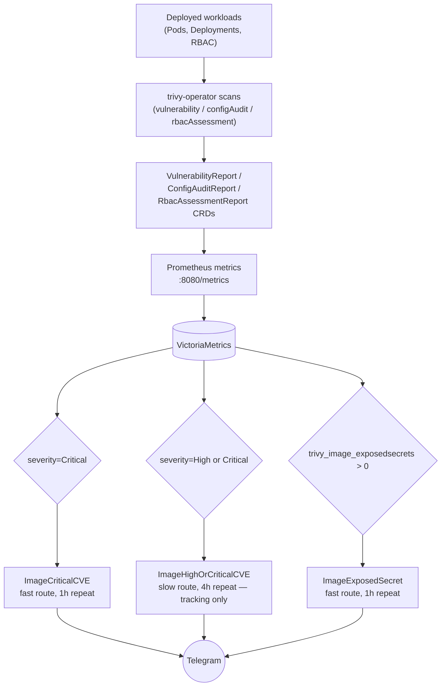
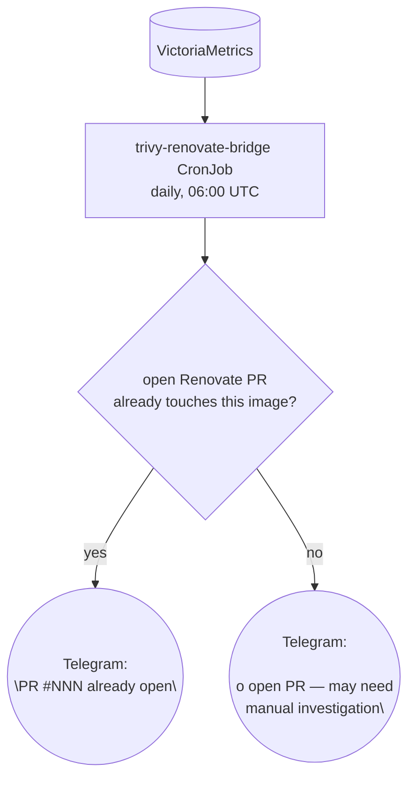
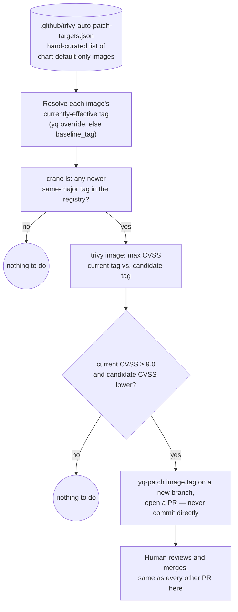

# Renovate + Trivy flow

How dependency updates and vulnerability findings move through this repo, from Renovate
opening a PR to a fix actually landing in `ops/talos_linux`. Diagrams are generated from
the manifests in `.github/workflows/`, `cluster/base/infrastructure/13-trivy-operator/`,
`cluster/base/infrastructure/30-trivy-renovate-bridge/`, and
`cluster/base/infrastructure/04-grafana/helmrelease.yaml` — not hand-drawn intent.

This is a living document. If a diagram and the manifests disagree, the manifests are
correct — open a PR to fix the diagram.

Two independent pipelines exist, and most of the design complexity here is in how they
connect (or fail to). **PR-time** (`section 1`) only sees images a Renovate PR is
proposing to change — including, since 2026-09-09, images the PR changes without saying
so, because the chart renders them. **Continuous** (`section 2`) only sees images already
deployed in the cluster. Neither one alone can catch "an already-deployed image just got a
new Critical CVE and nobody proposed a fix" — that gap, and the bridge closing it, is
`section 3`.

## 1. PR-time: the image gate

`.github/workflows/trivy-automerge.yml` driving `scripts/pr-image-gate.py`, triggered on
every Renovate PR carrying a `minor-update` or `security` label.

**The gate does not read the PR diff.** It resolves the complete set of image references at
the base revision and at the head revision, and compares the two sets. A tag change, a
registry change, a repository rename and a chart changing its own defaults then all arrive
as the same kind of event.

That design is not incidental. Until 2026-09-09 the gate did grep the diff for `image:`
lines, and the consequences were only visible once someone looked: every ADR-009 pin is a
`registry`/`repository`/`tag` triple in HelmRelease values, so the grep matched *none* of
them. Real image updates were classified as "chart-only" and merged with nothing scanned:
PRs #520, #523, #530 and #535 all merged that way, and one was holding an image at CVSS 9.1.

### What "an image" means depends on how the workload is deployed

This is the distinction that drives everything below.

**Deployments without Helm** — plain manifests under `cluster/base/**`: CronJobs, Jobs,
Deployments carrying a literal `image: repo:tag`. The tag written in the file *is* the
running version; nothing else has a say. The backup CronJobs (aws-cli, rclone, the three
`pg_dump` clients) and the reconciler are all this shape.

One source, and it is sufficient: the `image:` scalar, at both revisions.

**Deployments via Helm** — a `HelmRelease`, where the running version can be decided in
three different places, only one of which appears in a diff:

| source | what it resolves | what only it can catch |
| --- | --- | --- |
| `static` | values pins — any mapping carrying a non-empty `repository` + `tag` | the pins ADR-009 requires; the old grep saw none of these |
| `rendered` | `helm template` at the pinned chart version, with our values applied | an image this repository never mentions, and a chart that moves its own registry or repository between versions |
| `appVersion` | the chart's own idea of the app version, vs the pin that overrides it | a chart bump that moves `appVersion` *past* a frozen pin — which produces no image diff at all |

The static rule is structural — *any* mapping with `repository` and `tag`, whatever its
parent key is called. Keying on a block named `image` would miss ten of Longhorn's pins,
which live under `engine`, `instanceManager`, `attacher`, `provisioner` and five more.

Rendering covers 22 of 23 HelmReleases. `tailscale-operator` is skipped and says so in the
PR comment, because its `valuesFrom` lives in a Secret that does not exist in CI. Renders
use Helm 3.x deliberately: helm-controller renders with Helm 3, and a gate that renders
differently from the cluster answers a question nobody asked.

Identical references are scanned once. Where a pin fully decides the image, `static` and
`rendered` resolve to the same pair, and the report shows `rendered, static` on one row —
confirmation that both paths agree, not a hidden duplicate.

### Checks applied to each changed reference

**Rules, precisely:**

- **3a** — minor/patch version bump (never auto-merges a major)
- **3b** — no newer same-major tag exists with a strictly lower CVSS than the one proposed
  (if one does, the PR waits rather than merging something already known to be worse than
  what's about to exist). This is not theoretical: on #544 it refused Keycloak 26.3.5,
  which was CVSS 10.0 exactly like the image it replaced, and named 26.7.3 at 8.1 instead.
- **3c** — the proposed update doesn't *worsen* CVE posture (`new_cvss <= old_cvss`) — not
  "CVE posture is acceptable." An image can auto-merge while stuck at HIGH/CRITICAL
  indefinitely if every successive bump is merely no-worse than the last. `cvss-high`
  (finding, 2026-08-16 / fix, #144) exists specifically so that stays visible instead of
  disappearing into the merged-PR list.

**It fails closed.** Each of these blocks the merge rather than passing quietly:

- an image that cannot be scanned
- a **repository or registry change** — not a version bump at all, and comparing CVSS
  across two different projects says nothing
- a **version that goes backwards**, which is reachable without anyone proposing a
  rollback: a branch cut before a newer version merged still carries the older one, and
  merging it reverts the base. The CVE test cannot catch this, because a rollback's scores
  are equal or better by construction
- an `appVersion` that cannot be resolved, or a pin that cannot be ordered against it —
  `immich-postgresql` pins `17-vectorchord0.3.0-pgvectors0.3.0`, which is reported as
  unorderable rather than guessed at
- the `manual-review` label (bootstrap-critical components), regardless of CVE posture

A genuinely chart-only update — the chart version moved and no image reference changed at
either revision — still auto-merges on a `minor-update` label. The difference from the old
behaviour is that "no image changed" is now a *verified* result rather than an assumption —
PR #542 rendered four images on both revisions and compared them before saying so.

### Charts and their images move together

Renovate groups each chart with the images pinned beside it (`renovate.json`, one rule per
component keyed on the package file), so both arrive in one proposal. ADR-009 requires
this: in steady state a pin equals the chart's `appVersion`, so every chart bump moves
`appVersion` past the pin unless the pin moves with it.

Grouping narrows that window rather than closing it — two updates share a branch only when
both are available at once, and Renovate drops members still held by `minimumReleaseAge`
rather than holding the group back. That is exactly how zot drifted: the chart cleared the
age gate while its image had not. The `appVersion` check is what closes it.

## 2. Continuous: trivy-operator + alerting

Nothing here depends on a PR existing. trivy-operator scans whatever is actually running,
on its own schedule, independent of how it got there.

All three rules live in `04-grafana/helmrelease.yaml` (`Trivy CVE Alerts` group). They
match on the `severity` label directly (`Critical` / `High`), not a CVSS score regex —
Trivy's own severity classification is already CVSS-derived, and a regex has an
off-by-one boundary risk a label match doesn't.

**Known trap, hit twice already**: Grafana's file-based alert provisioning only
creates/updates rules present in `rules.yaml` — it never deletes one that's been removed.
Retiring a rule requires an explicit entry in `deleteRules.yaml`
(`cluster/overlays/1-node/patches/grafana-telegram.yaml`), or the old rule keeps running
forever with nothing pointing at it from git.

**Known trap, the metric itself**: `trivy_image_exposedsecrets` and
`trivy_vulnerability_id` are point-in-time series that persist until they naturally age
out of VictoriaMetrics — regenerating the underlying report (e.g. by deleting the CRD to
force a rescan) doesn't retroactively clear the *old* series immediately. A dashboard or
alert can show a finding for a few minutes after it's actually been fixed. Cross-check
against `kubectl get vulnerabilityreport` before treating a reading as current.

## 3. The gap: already-deployed images have no path back to a fix

Trivy's own review finding (2026-08-17): the two pipelines above don't talk to each
other. An image already running in the cluster that develops a new Critical CVE has
no automated route to "someone should bump this" — it just sits in a report (now, a
`ImageCriticalCVE` page) with no indication of whether a fix is one merge away or
genuinely blocked upstream.

**Live today** (`30-trivy-renovate-bridge/cronjob.yaml`): the discovery half — query
VictoriaMetrics for images with an active Critical CVE, check this repo's open PRs
(public repo, unauthenticated GitHub API, no credential needed), post a Telegram summary.
Reuses `monitoring/telegram-credentials` (already generic, not Grafana-specific) rather
than provisioning anything new. Verified live 2026-08-17: a forced run found 10 images
with active Critical CVEs, all correctly reported as having no open Renovate PR yet.

For images with an explicit `image.tag` override already present in this repo (the Trivy
scan job image, KubeOpenCode's agent images, mcp-server), Renovate already handles this
and a PR already exists whenever one's possible — branch `Y -- yes` covers them. The
CronJob's `Y -- no` branch is where it stops: it can tell you nothing has landed yet, but
it has no way to act, and historically nothing downstream of it ever did.

### Now implemented: `trivy-auto-patch.yml`

The gap only ever matters for images whose deployed tag comes from a chart's own bundled
default rather than an explicit override — Renovate has no string to bump, so no PR is
ever possible for them, no matter how long a Critical CVE sits open. Confirmed live
2026-08-17 for exactly two images in this repo: `grafana/grafana` and `velero/velero`.

> **Superseded in part, 2026-09-09.** Both of those images now carry explicit pins, along
> with 35 others: [ADR-009](adr/0009-explicit-image-pins.md) made pinning the rule rather
> than the exception, so "Renovate has no string to bump" describes far fewer images than
> it did. What remains genuinely unpinnable is the set ADR-009 lists as limitations —
> charts exposing no image tag value at all, and charts that resolve by digest. Those are
> still invisible to Renovate, and are now at least *watched*: section 1's rendered source
> compares them across revisions, so a chart bump that changes one is caught even though
> nothing can propose that change on its own. `trivy-auto-patch.yml` below is still the
> only thing that can open a PR for them.

Closing this is a **separate, independent GitHub Actions workflow**
(`.github/workflows/trivy-auto-patch.yml`, landed via #166/#167), not a new branch bolted
onto the CronJob above. That was a deliberate design choice, not an oversight: the
CronJob's job is "what's
actually running and is it vulnerable, tell me," against live cluster state; the
auto-patch workflow's job is "does this specific, hand-curated set of chart-default
images have a better version available," against this repo's own declared state. Neither
needs the other's plumbing, so neither depends on it — no in-cluster query, no Tailscale,
no Grafana Service Account or token. The only inputs are this repo's checked-out YAML and
the public container registry, and the only credential is the ambient, free `GITHUB_TOKEN`
every workflow already gets.

This list is intentionally small and hand-maintained, not auto-discovered — the same
reasoning as the `trivy-auto-patch-targets.json` comment block: fetching every chart's own
`values.yaml` to infer its default tag is fragile across chart repos with inconsistent
tagging conventions, and an image only needs adding here once, the first time it's a
chart-default-only image with a CVE worth automating around. Once a PR from this workflow
merges, the image has an explicit `image.tag` override like any Renovate-tracked image, so
the workflow reads that override instead of `baseline_tag` on every subsequent run —
`baseline_tag` only matters until the first patch lands.

Runs daily at 06:30 UTC (`workflow_dispatch` also available for an on-demand run) and only
ever opens a PR, exactly like `trivy-automerge.yml`'s own PRs — nothing it does merges
without a human reviewing it first.
