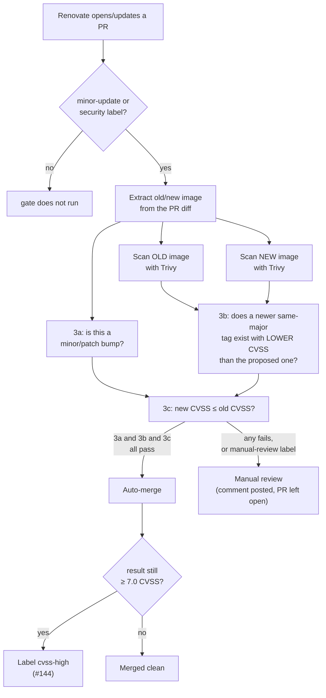
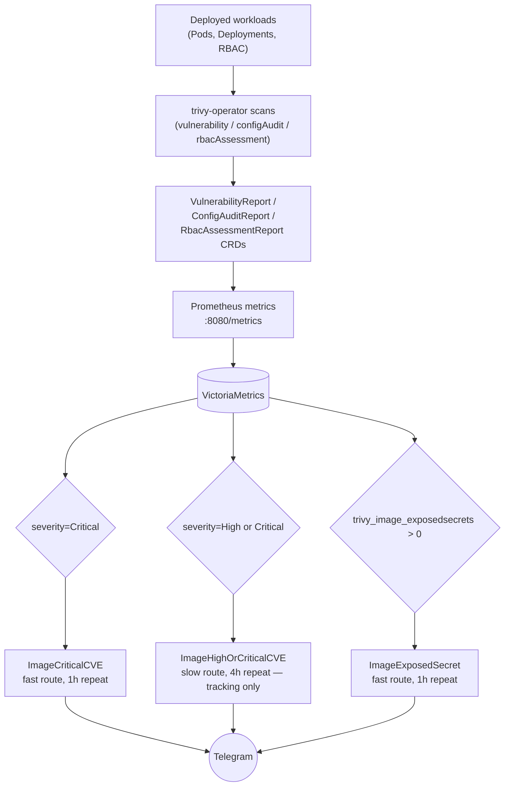
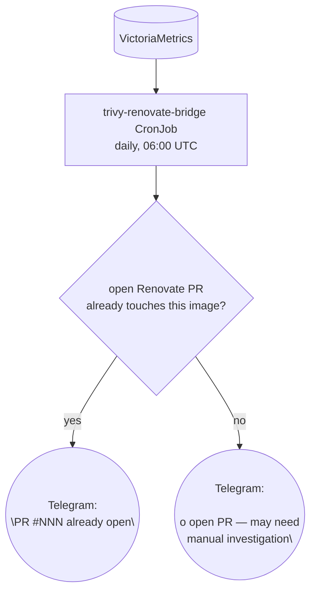
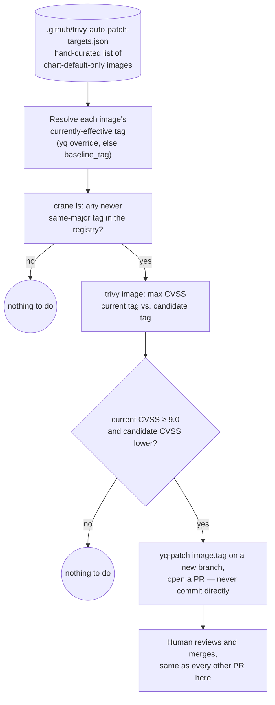

# Renovate + Trivy flow

How dependency updates and vulnerability findings move through this repo, from Renovate
opening a PR to a fix actually landing in `ops/talos_linux`. Diagrams are generated from
the manifests in `.github/workflows/`, `cluster/base/infrastructure/13-trivy-operator/`,
`cluster/base/infrastructure/30-trivy-renovate-bridge/`, and
`cluster/base/infrastructure/04-grafana/helmrelease.yaml` — not hand-drawn intent.

This is a living document. If a diagram and the manifests disagree, the manifests are
correct — open a PR to fix the diagram.

Two independent pipelines exist, and most of the design complexity here is in how they
connect (or fail to). **PR-time** (`section 1`) only sees images already showing up as a
diff in a Renovate PR. **Continuous** (`section 2`) only sees images already deployed in
the cluster. Neither one alone can catch "an already-deployed image just got a new
Critical CVE and nobody proposed a fix" — that gap, and the bridge closing it, is
`section 3`.

## 1. PR-time: the Trivy CVE gate

`.github/workflows/trivy-automerge.yml`, triggered on every Renovate PR carrying a
`minor-update` or `security` label.

**Rules, precisely:**

- **3a** — minor/patch version bump (never auto-merges a major)
- **3b** — no newer same-major tag exists with a strictly lower CVSS than the one proposed
  (if one does, the PR waits rather than merging something already known to be worse than
  what's about to exist)
- **3c** — the proposed update doesn't *worsen* CVE posture (`new_cvss <= old_cvss`) — not
  "CVE posture is acceptable." An image can auto-merge while stuck at HIGH/CRITICAL
  indefinitely if every successive bump is merely no-worse than the last. `cvss-high`
  (finding, 2026-08-16 / fix, #144) exists specifically so that stays visible instead of
  disappearing into the merged-PR list.

Chart-only updates (no image diff detected) skip the scan entirely and auto-merge if
labeled `minor-update`. PRs labeled `manual-review` (bootstrap-critical components) never
auto-merge regardless of CVE posture.

## 2. Continuous: trivy-operator + alerting

Nothing here depends on a PR existing. trivy-operator scans whatever is actually running,
on its own schedule, independent of how it got there.

All three rules live in `04-grafana/helmrelease.yaml` (`Trivy CVE Alerts` group). They
match on the `severity` label directly (`Critical` / `High`), not a CVSS score regex —
Trivy's own severity classification is already CVSS-derived, and a regex has an
off-by-one boundary risk a label match doesn't.

**Known trap, hit twice already**: Grafana's file-based alert provisioning only
creates/updates rules present in `rules.yaml` — it never deletes one that's been removed.
Retiring a rule requires an explicit entry in `deleteRules.yaml`
(`cluster/overlays/1-node/patches/grafana-telegram.yaml`), or the old rule keeps running
forever with nothing pointing at it from git.

**Known trap, the metric itself**: `trivy_image_exposedsecrets` and
`trivy_vulnerability_id` are point-in-time series that persist until they naturally age
out of VictoriaMetrics — regenerating the underlying report (e.g. by deleting the CRD to
force a rescan) doesn't retroactively clear the *old* series immediately. A dashboard or
alert can show a finding for a few minutes after it's actually been fixed. Cross-check
against `kubectl get vulnerabilityreport` before treating a reading as current.

## 3. The gap: already-deployed images have no path back to a fix

Trivy's own review finding (2026-08-17): the two pipelines above don't talk to each
other. An image already running in the cluster that develops a new Critical CVE has
no automated route to "someone should bump this" — it just sits in a report (now, a
`ImageCriticalCVE` page) with no indication of whether a fix is one merge away or
genuinely blocked upstream.

**Live today** (`30-trivy-renovate-bridge/cronjob.yaml`): the discovery half — query
VictoriaMetrics for images with an active Critical CVE, check this repo's open PRs
(public repo, unauthenticated GitHub API, no credential needed), post a Telegram summary.
Reuses `monitoring/telegram-credentials` (already generic, not Grafana-specific) rather
than provisioning anything new. Verified live 2026-08-17: a forced run found 10 images
with active Critical CVEs, all correctly reported as having no open Renovate PR yet.

For images with an explicit `image.tag` override already present in this repo (the Trivy
scan job image, KubeOpenCode's agent images, mcp-server), Renovate already handles this
and a PR already exists whenever one's possible — branch `Y -- yes` covers them. The
CronJob's `Y -- no` branch is where it stops: it can tell you nothing has landed yet, but
it has no way to act, and historically nothing downstream of it ever did.

### Built, pending merge: `trivy-auto-patch.yml`

The gap only ever matters for images whose deployed tag comes from a chart's own bundled
default rather than an explicit override — Renovate has no string to bump, so no PR is
ever possible for them, no matter how long a Critical CVE sits open. Confirmed live
2026-08-17 for exactly two images in this repo: `grafana/grafana` and `velero/velero`.

Closing this is a **separate, independent GitHub Actions workflow**
(`.github/workflows/trivy-auto-patch.yml`, PRs #166/#167 — awaiting review/merge, not yet
on `ops/talos_linux`), not a new branch bolted onto the CronJob above. That was a
deliberate design choice, not an oversight: the CronJob's job is "what's
actually running and is it vulnerable, tell me," against live cluster state; the
auto-patch workflow's job is "does this specific, hand-curated set of chart-default
images have a better version available," against this repo's own declared state. Neither
needs the other's plumbing, so neither depends on it — no in-cluster query, no Tailscale,
no Grafana Service Account or token. The only inputs are this repo's checked-out YAML and
the public container registry, and the only credential is the ambient, free `GITHUB_TOKEN`
every workflow already gets.

This list is intentionally small and hand-maintained, not auto-discovered — the same
reasoning as the `trivy-auto-patch-targets.json` comment block: fetching every chart's own
`values.yaml` to infer its default tag is fragile across chart repos with inconsistent
tagging conventions, and an image only needs adding here once, the first time it's a
chart-default-only image with a CVE worth automating around. Once a PR from this workflow
merges, the image has an explicit `image.tag` override like any Renovate-tracked image, so
the workflow reads that override instead of `baseline_tag` on every subsequent run —
`baseline_tag` only matters until the first patch lands.

Once merged, runs daily at 06:30 UTC (`workflow_dispatch` also available for an on-demand
run) and only ever opens a PR, exactly like `trivy-automerge.yml`'s own PRs — nothing it
does merges without a human reviewing it first.
