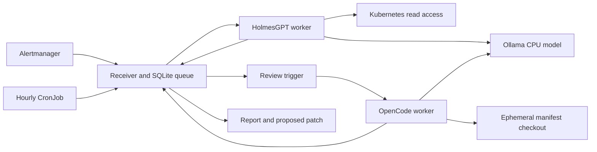

# Kubernetes investigation MVP: HolmesGPT + OpenCode

Alertmanager and an hourly scan feed a durable queue. HolmesGPT investigates the
configured namespace. A reviewer can request OpenCode to propose a change to a
manifest repository. Reports, explanations and patches remain retrievable through
the API. `AUTO_PROPOSE=true` enables the entire chain, while still only producing
patches for review.



## Implementation status

This MVP is stored under `tools/kube-agent-mvp` and is not registered in either
Flux profile. Its proposal checkout targets `bibAtWork/Edge_GitOps` branch
`ops/talos_linux`. Before promoting it to a live application, follow the
[platform extension contract](../../docs/runbooks/platform-extension.md), including
network policies, telemetry, encrypted credentials and recovery enrollment for
the report PVC. Manual manifests below are for an opt-in pilot.

Implemented and tested locally: webhook handling, namespace filtering,
authentication, persistent queue, alert deduplication, a global execution slot,
lease expiry, review transition, command timeout, and patch capture including new
files. The offline integration test uses fake agent commands and real Git.

**Live model integration and image builds are not verified in this workspace.**
No cluster is attached and shell network access is blocked, including a live
localhost HTTP smoke. The GitHub connector was used to inspect HolmesGPT 0.42.0's
Docker entrypoint, CLI and Ollama documentation. Its adapter uses the image's
Python entrypoint in non-interactive mode and reads the final result from JSON,
excluding CLI logs. OpenCode and Ollama version tags were selected from their
published GitHub releases. These are source checks, not runtime validation.
The adapters use configurable command argument arrays; validate the container
interfaces before rollout. Model tool-call quality is also unverified.
Kubernetes manifests use stable APIs intended for
1.37; this is not a claim of testing on Kubernetes 1.37.

## Try the offline pipeline

Requires Python 3.11+ and Git. There are no Python runtime dependencies.

```sh
cd tools/kube-agent-mvp
python -m unittest discover -v
python -m examples.demo
```

The demo exercises alert queue → simulated investigation → review trigger →
simulated OpenCode edits → persisted real Git diff. It does not contact a model
or cluster. Its source in `tests/test_pipeline.py` shows the artifacts asserted.

## Build and validate the adapters

The starter pins HolmesGPT 0.42.0, OpenCode 1.18.34 and Ollama 0.35.1.
Validate these containers on your architecture; use digests for immutable builds.

```sh
docker build -f Dockerfile.api -t kube-agent-api:dev .
docker build -f Dockerfile.holmes -t kube-agent-holmes:dev .
docker build -f Dockerfile.opencode -t kube-agent-opencode:dev .

# Verify the CLI entrypoints before deploying the workers.
docker run --rm --entrypoint python kube-agent-holmes:dev /app/holmes_cli.py ask --help
docker run --rm --entrypoint opencode kube-agent-opencode:dev run --help
```

For pinned builds, supply `--build-arg HOLMES_IMAGE=robustadev/holmes:<version>`
or `--build-arg OPENCODE_VERSION=<version>`. The Holmes image must provide
`python`, `/app/holmes_cli.py`, and its Kubernetes investigation tools (`kubectl`).
If an upstream image needs a different entrypoint, adjust `HOLMES_COMMAND`.

Default adapters:

```text
python /app/holmes_cli.py ask <prompt> --model ollama_chat/qwen3:4b --no-interactive --json-output-file <output>
opencode run --model ollama/qwen3:4b <prompt>
```

`HOLMES_COMMAND` and `OPENCODE_COMMAND` are JSON arrays with `{prompt}` and
`{model}` substitutions; Holmes also supports `{output}` for its JSON result file.
They execute directly, with no shell interpolation. For a separately installed
Holmes CLI, an alternative adapter is:

```json
["holmes", "ask", "{prompt}", "--model", "{model}", "--no-interactive", "--json-output-file", "{output}"]
```

Holmes uses its own tools; this MVP does not emulate an investigation. Configure
its supported toolsets/config file if you want Prometheus or Loki queries. The
initial Role grants workload, event and pod-log access in one namespace; it
does not grant cluster-wide node access, Secrets, pod exec, or write operations.
Some upstream tools may attempt broader queries and receive RBAC denials; check
the report and restrict those toolsets rather than widening access blindly.

## Deploy to Kubernetes

1. Push the three images to your registry, and replace the image references in
   `deploy/kubernetes.yaml`. Use immutable tags/digests for rollout.
2. `REPO_URL` and `REPO_REF` already target this repository's `ops/talos_linux`
   branch. Change them for a test repository during the pilot. The MVP supports
   public HTTPS repositories without embedded credentials. Omitting `REPO_REF`
   checks out the repository's default branch.
3. Set `WATCH_NAMESPACE` and the Role/RoleBinding namespace together. Both default
   to `default`. Multi-namespace and multi-cluster routing are outside this MVP.
4. Select a StorageClass if your cluster has no default. The API uses a 2 GiB PVC
   and single-replica `Recreate` Deployment; SQLite is not configured for HA.
5. Create a token and apply the manifests:

```sh
kubectl create namespace agent-system
# Save securely: the same token is needed by Alertmanager and local API clients.
export API_TOKEN="$(python -c 'import secrets; print(secrets.token_urlsafe(32))')"
kubectl -n agent-system create secret generic agent-auth \
  --from-literal=API_TOKEN="$API_TOKEN"
kubectl apply -f deploy/kubernetes.yaml
kubectl apply -f deploy/ollama.yaml
kubectl -n agent-system rollout status deployment/ollama
kubectl -n agent-system exec deployment/ollama -- ollama pull qwen3:4b
```

`deploy/ollama.yaml` is optional. To use an existing Ollama instance, change
`OLLAMA_API_BASE` in the ConfigMap. Holmes receives that environment variable;
OpenCode's generated provider configuration adds `/v1` to the URL.

For CPU-only use, Ollama is configured for one parallel request, one loaded model
and a 4,096-token context. Its 4,500 MiB memory limit plus the application limits
total roughly 6.2 GiB. This excludes the OS, Kubernetes components and existing
workloads. An 8 GB node may need a lower model size or external Ollama. No GPU is
requested. Smaller contexts may limit multi-step investigations, and client
options can affect context usage; measure actual memory before increasing it.
Qwen3 thinking is not explicitly disabled by these adapters. If inference exceeds
the 600-second limit, use your provider's supported non-thinking configuration,
reduce evidence, or choose a lighter model. Do not mistake a timeout for a healthy
workload.

First smoke-test the deployed CLI interfaces with the actual Ollama endpoint:

```sh
kubectl -n agent-system exec deployment/investigator -- \
  python /app/holmes_cli.py ask 'List unhealthy pods only in namespace default and cite evidence.' \
  --model ollama_chat/qwen3:4b --no-interactive
kubectl -n agent-system exec deployment/proposer -- opencode run --help
```

If Holmes cannot tool-call with the selected model/provider or your version uses
a different model identifier, update `HOLMES_MODEL` and `HOLMES_COMMAND` before
accepting real alerts. All three applications must be restarted after ConfigMap
or Secret changes:

```sh
kubectl -n agent-system rollout restart deployment/agent-api \
  deployment/investigator deployment/proposer
```

## Trigger, review and export

Keep the API as a ClusterIP Service. Port-forward for local use:

```sh
kubectl -n agent-system port-forward service/agent-api 8080:8080
```

In another terminal, with the same `API_TOKEN`:

```sh
curl -fsS -H "Authorization: Bearer $API_TOKEN" \
  -H 'Content-Type: application/json' \
  --data-binary @examples/alert.json http://localhost:8080/v1/alertmanager

# Alternatively trigger a namespace health scan:
curl -fsS -H "Authorization: Bearer $API_TOKEN" \
  -H 'Content-Type: application/json' -d '{}' http://localhost:8080/v1/scan

curl -fsS -H "Authorization: Bearer $API_TOKEN" http://localhost:8080/v1/incidents
```

Copy the returned identifier into `INCIDENT_ID`. Wait for `awaiting_review`, read
the evidence, then request the OpenCode stage:

```sh
export INCIDENT_ID=PASTE_ID_HERE
curl -fsS -H "Authorization: Bearer $API_TOKEN" \
  "http://localhost:8080/v1/incidents/$INCIDENT_ID"
curl -fsS -H "Authorization: Bearer $API_TOKEN" \
  -H 'Content-Type: application/json' -d '{}' \
  "http://localhost:8080/v1/incidents/$INCIDENT_ID/propose"

# After status becomes complete:
curl -fsS -H "Authorization: Bearer $API_TOKEN" \
  "http://localhost:8080/v1/incidents/$INCIDENT_ID" > incident.json
python -c 'import json; from pathlib import Path; d=json.load(open("incident.json")); Path("proposal.patch").write_text(d.get("patch") or ""); Path("investigation.md").write_text(d.get("report") or "")'
```

The proposal records the repository URL and base commit. Inspect the patch and
validate it against that repository revision before
applying it. An empty patch with an explanation is a valid result when evidence
does not support a repository change. The service does not push, open a PR, or
deploy changes. Those are later integrations.

Merge `examples/alertmanager.yaml` into your existing Alertmanager configuration,
mounting the authentication Secret into its pod. Alertmanager's grouping reduces
duplicate work. Only firing alerts explicitly labeled with the configured
namespace are accepted; cluster-level or unlabeled alerts are ignored.

## Operating limits

- One execution slot is shared by both workers. Each command has a runtime limit;
  the 1,200-second lease exceeds the default clone + agent + patch limits.
  If increasing timeouts, increase the lease accordingly.
- On worker loss, lease expiry marks the incident failed when a worker next polls.
  Expired work is not automatically replayed. Confirm the old worker is stopped
  before submitting another investigation. Repeated alerts/scans are deduplicated
  for an hour, including failed work.
- The receiver token is shared by trusted clients/workers in this MVP. Do not
  expose it publicly. There is no per-client authorization or built-in TLS.
- OpenCode has no mounted Kubernetes token and receives no Git push credential.
  Generated permissions deny shell commands and allow file edits. Project/Claude
  configuration disabling is requested through environment variables; verify
  those controls in the OpenCode version you pin. Only use a trusted repository;
  these settings are not a sandbox for hostile repository plugins or code.
- Agent output and alert annotations can contain sensitive workload data. Reports
  reside in the API PVC; protect API access and use encrypted storage if required.
- Logs identify stages/failure types without copying agent output. Detailed agent
  stderr is not retained. Reproduce CLI failures with an operator-controlled smoke
  test for diagnosis.
- No automatic database retention, backlog cap, Prometheus metrics, or outbound
  NetworkPolicy is included. Monitor PVC usage and queue age during the pilot.
- The model/server is a dependency: `/healthz` checks API process health, not
  investigation quality or Ollama readiness. Agent failures persist as `failed`.

## Acceptance test on your 1.37 cluster

Before deployment, run `kubectl apply --dry-run=server -f deploy/kubernetes.yaml`
against that cluster with the appropriate namespace already created. Verify the
storage and admission policies as well as API compatibility.

Check RBAC:

```sh
kubectl auth can-i get pods -n default \
  --as=system:serviceaccount:agent-system:investigator
kubectl auth can-i get secrets -n default \
  --as=system:serviceaccount:agent-system:investigator
kubectl auth can-i create pods/exec -n default \
  --as=system:serviceaccount:agent-system:investigator
kubectl auth can-i patch deployments -n default \
  --as=system:serviceaccount:agent-system:investigator
```

Expected: `yes`, then three `no` answers (assuming no unrelated broader bindings).
In a disposable workload namespace, test a known failed rollout, CrashLoopBackOff,
and pending pod. Check that the report identifies observed evidence rather than
inventing causes. Request a patch against a test manifest repository, then confirm
that neither the live workload nor the repository was modified. Also restart the
receiver and verify that its reports persist.
